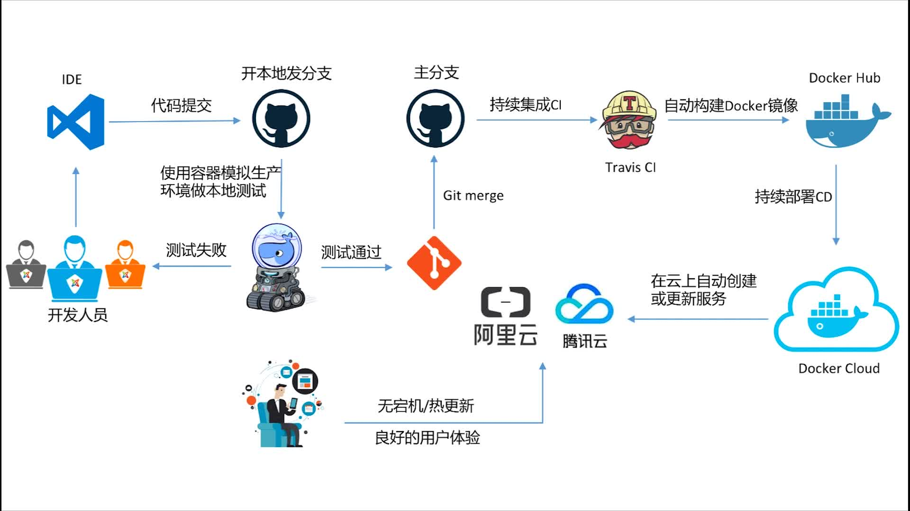

# [系统学习Docker 践行DevOps理念](https://coding.imooc.com/learn/list/189.html)

+ 第3章 Docker的镜像和容器
  + 3-1 Docker架构和底层技术简介  (09:20)
  + 3-2 Docker Image概述  (11:03)
  + 3-3 DIY一个Base Image  (12:16)
  + 3-4 初识Container  (15:10)
  + 3-5 构建自己的Docker镜像  (10:18)
  + 3-6 Dockerfile语法梳理及最佳实践  (10:45)
  + 3-7 RUN vs CMD vs Entrypoint  (15:42)
  + 3-8 镜像的发布  (16:14)
  + 3-9 Dockerfile实战  (17:49)
  + 3-10 容器的操作  (09:40)
  + 3-11 Dockerfile实战(2)  (11:32)
  + 3-12 容器的资源限制  (10:11)

+ 第4章 Docker的网络
  + 4-1 本章概述和实验环境介绍  (08:08)
  + 4-2 网络基础回顾  (12:26)
  + 4-3 Linux网络命名空间  (16:53)
  + 4-4 Docker bridge0详解  (10:22)
  + 4-5 容器之间的link  (13:31)
  + 4-6 容器的端口映射  (13:55)
  + 4-7 容器网络之host和none  (05:29)
  + 4-8 多容器复杂应用的部署演示  (15:04)
  + 4-9 Overlay和Underlay的通俗解释  (07:49)
  + 4-10 Docker Overlay网络和etcd实现多机容器通信  (15:25)

+ 第5章 Docker的持久化存储和数据共享
  + 5-1 本章介绍  (05:09)
  + 5-2 本章实验环境介绍  (04:34)
  + 5-3 数据持久化之Data Volume  (09:43)
  + 5-4 数据持久化之Bind Mouting  (07:40)
  + 5-5 开发者利器-Docker+Bind Mout  (06:39)

+ 第6章 Docker Compose多容器部署
  + 6-1 根据前面所学部署一个wordpress  (09:02)
  + 6-2 Docker Compose到底是什么  (11:40)
  + 6-3 Docker Compose的安装和基本使用  (14:43)
  + 6-4 水平扩展和负载均衡  (10:28)
  + 6-5 部署一个复杂的投票应用  (08:19)

+ 第9章 容器编排Kubernetes
  + 9-1 Kubenetes简介  (12:01)
  + 9-2 Minikube快速搭建K8S单节点环境  (11:57)
  + 9-3 K8S最小调度单位Pod  (13:43)
  + 9-4 ReplicaSet和ReplicationController  (11:47)
  + 9-5 Deployment_.mp4  (10:43)
  + 9-6 使用Tectonic在本地搭建多节点K8S集群  (11:31)
  + 9-7 k8s基础网络Cluster Network  (11:50)
  + 9-8 Service简介和演示  (15:53)
  + 9-9 NodePort类型Service以及Label的简单实用_音频.mp4  (18:04)
  + 9-10 准备工作——使用kops在亚马逊AWS上搭建k8s集群  (13:15)
  + 9-11 使用kops在亚马逊AWS上搭建k8s集群.mp4  (13:33)
  + 9-12 LoadBlancer类型Service以及AWS的DNS服务配置  (05:06)
  + 9-13 在亚马逊k8s集群上部署wordpress  (10:52)

+ 第10章 容器的的运维和监控
  + 10-1 容器的基本监控  (12:46)
  + 10-2 k8s集群运行资源监控——Heapster+Grafana+InfluxDB  (11:51)
  + 10-3 根据资源占用自动横向伸缩  (10:49)
  + 10-4 k8s集群Log的采集和展示——ELK+Fluentd  (10:58)
  + 10-5 k8s集群监控方案Prometheus  (13:10)

+ 第11章 Docker+DevOps实战——过程和工具
  + 11-1 本章简介  (07:45)
  + 11-2 搭建GitLab服务器  (07:21)
  + 11-3 搭建GitLab CI服务器和Pipeline演示  (14:21)
  + 11-4 基于真实Python项目的CI演示  (14:41)
  + 11-5 简单Java项目的CI演示  (06:33)
  + 11-6 使用Python项目演示的CICD流程  (22:05)
  + 11-7 CI实现版本自动发布  (16:26)
  + 11-8 本章总结和如何继续学习  (06:38)
