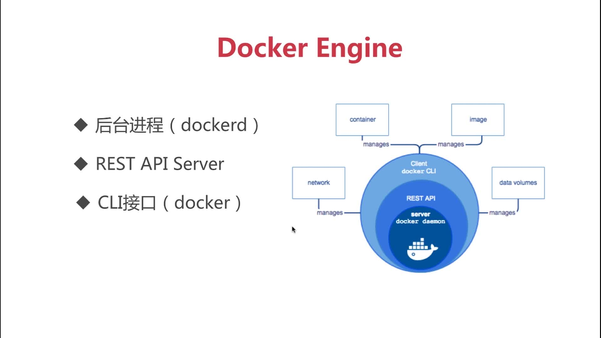
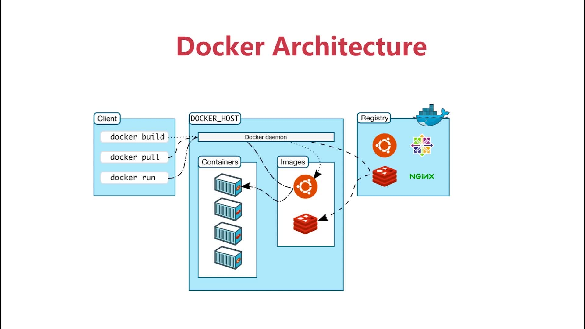
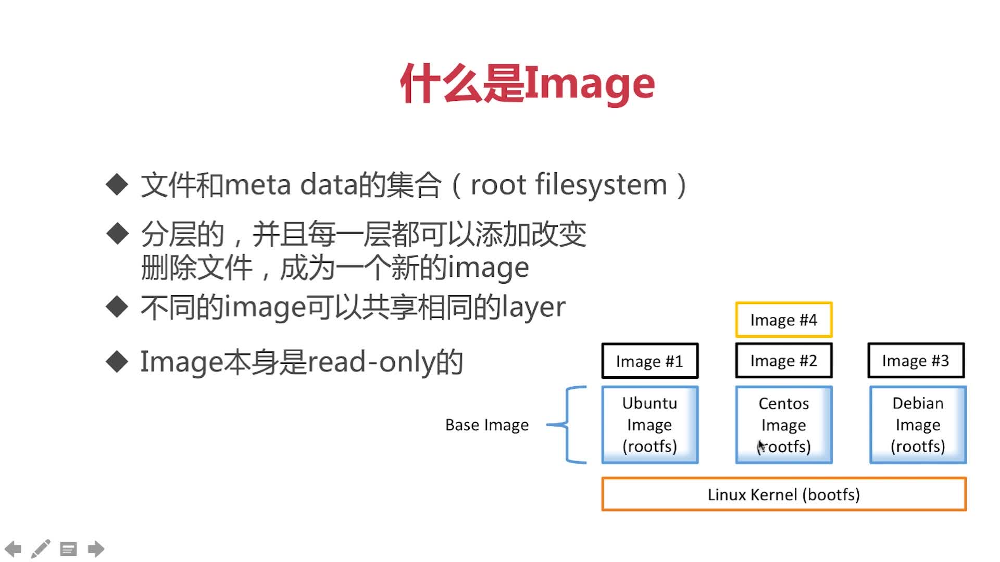
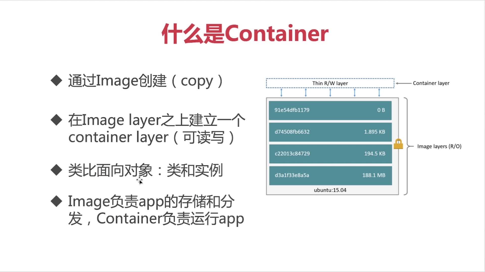

# 第3章：Docker的镜像和容器

## 3-1 Docker的架构和底层技术简介

+ Docker的结构
  + 

+ Docker的远程连接
  > Docker的Server和Client可以在一台上，也可以不在一台上。当想在一台上访问另一台的Docker Server时，只需要在Server所在的机器上开放2375端口即可，可以参考教程[Idea连接服务器docker并部署代码到docker实现一键启动](https://www.cnblogs.com/hsz-csy/p/9488469.html)

  + 

+ Docker的核心概念
  + (1)Namespaces(命名空间) : 做隔离pid、net、ipc、mnt、uts。比如起多个容器的时候容器之间是隔离的
  + (2)Control groups : 做资源限制，比如限制某个容器的内存最多200m,另一个最多300m
  + (3)Union file systems : Container 和image的分层

## 3-2 Docker Image概述



## 3-4 初识Container



+ 查看正在运行的容器：`docker ps`
+ 查看所有正在运行的容器：`docker ps -a`
+ 删除所有退出的container`docker container prune`
+ 交互式运行容器：`docker run -it 镜像名`，尤其适合用在运行操作系统镜像上，比如ubuntu和centos

## 3-5 构建自己的Docker镜像

+ 主要是`docker commit -m='提交信息' -a='作者' 容器id 新的镜像名:版本`和`docker build`,见上一部分。都有的
+ 通过docker build操作Dockerfile来生成镜像`docker build -t l00379880/centos-vim .`

## 3-6 Dockerfile语法梳理及最佳实践

### FROM(基础镜像)

> 尽量使用DockerHub官方的image作为base image,原因很简单，为了安全

+ `FROM scratch` : 制作 base image
+ `FROM centos`  ：以centos为基础制作镜像
+ `FROM ubuntu:14.04`:指定版本为14.04的ubuntu作为基础镜像制作新的镜像

### LABEL(帮助信息)

> metadata(帮助信息)不可少

+ `LABEL maintainer=liangshanguang@huawei.com`:镜像的维护者
+ `LABEL version="1.0"`:镜像的版本
+ `LABEL description="This is a demo by l00379880`:镜像的描述信息

### RUN(制作镜像过程中运行的命令)

> 为了美观，复杂的RUN请用反斜线换行。避免无用分层(每个RUN命令都会生成一层)，最好合并多条命令成一行

+ 例子1：反斜线换行

```Dockerfile
RUN yum update && yum install -y vim \
    python-dev # 反斜线换行
```

+ 多条命令合并

```Dockerfile
RUN apt-get update && apt-get install -y perl\
    pwgen --no-install-recommands && rm -rf \
    /var/lib/apt/list/*
```

### WORKDIR(设置当前工作目录)

> 用`WORKDIR`,不要用`RUN cd`!!!尽量使用绝对目录,不要使用相对目录

```Dockerfile
WORKDIR /test # 如果目录不存在会自动创建
WORKDIR demo  # 相当于cd demo
RUN pwd       # 输出结果应该是/test/demo
```

### ADD 和 COPY，把本地文件添加到容器中去

> 大部分情况，COPY优于ADD；ADD除了COPY的功能外还有`解压功能`；添加远程文件/目录请用curl或者wget

```Dockerfile
ADD hello /
```

```Dockerfile
ADD test.tar.gz /  # 添加到根目录并解压
```

```Dockerfile
WORKDIR /root
ADD hello test/  # 输出 /root/test/hello
```

```Dockerfile
WORKDIR /root
COPY hello test/ # 和上面的命令一样
```

### ENV(设置环境变量)

> 尽量使用ENV来提高Dockerfile的可维护性

```Dockerfile
ENV MYSQL_VERSION 5.7.15 # 设置常量
RUN apt-get install -y mysql-server= "${MYSQL_VERSION}" \
    && rm -rf /var/lib/apt/lists/*  # 引用环境变量
```

### VOLUME(存储) 和 EXPOSE(网络)，第4章单独讲

## 3-7 RUN vs CMD vs ENTRYPOINT

### 命令分Shell格式和Exec格式

> 区别在于后者有中括号，中括号内是一个个的字符串，而且对环境变量支持不好

```Dockerfile
# Shell 格式, 打出hello Docker
FROM centos
ENV name Docker
ENTRYPOINT echo "hello $name"
```

```Dockerfile
# Exec 格式,打印出hello $name, 直接调用环境变量$name是不行的
FROM centos
ENV name Docker
ENTRYPOINT [”/bin/echo“, "hello $name"]
```

```Dockerfile
# Exec 格式,直接调用环境变量$name是不行的,只能指定Bash来调
FROM centos
ENV name Docker
ENTRYPOINT ["/bin/bash","-c","echo hello $name"]
```

### CMD(可被覆盖) 和 ENTRYPOINT(不可被覆盖，一定会执行)

+ `RUN` : 执行命令并创建新的Image Layer
+ `CMD` : 设置容器启动后默认执行地命令和参数,如果`docker run`指定了其他命令，`CMD命令被忽略`，如果定义了多个CMD，只有最后一个会被执行
+ `ENTRYPOINT` : 设置容器启动时运行的命令。让容器以应用程序或者服务的形式运行。`不会被忽略，一定会执行`。
  > `最佳实践`：写一个shell脚本作为ENTRYPOINT.例如`ENTRYPOINT ["docker-entrypoint.sh"]`

### 进入正在执行的容器

`docker exec -it 0ea4bb43cdf0 /bin/bash`

### 查看容器运行的日志

`docker logs 容器id`

## 3-9 Dcokerfile实战

自己写Dockerfile的步骤:

+ 配置基础镜像
+ 安装需要的库
+ 拷贝本地需要的文件到镜像中
+ 通过WORKDIR切到需要的目录
+ EXPOSE对外暴露端口
+ 执行启动命令

注意：Dockerfile中的每一行在Build过程中都会生成一种临时镜像，可以用`docker run -it 镜像id`进入这些中间镜像来定位Build出现的问题

## 3-12 容器的资源限制

+ 限制内存
  + `docker run --memory=200m`: 最大消耗200*2=400m的内存(普通内存+swap的内存)
  + `docker run --verbose`:详细打印日志
  + `--vm-bytes`：设置容器的内存限制
  + `-c(--cu-shares int值)`:CPU最高占用的值

+ 限制CPU()
  + `--cpu-shares=0到100的整数`
