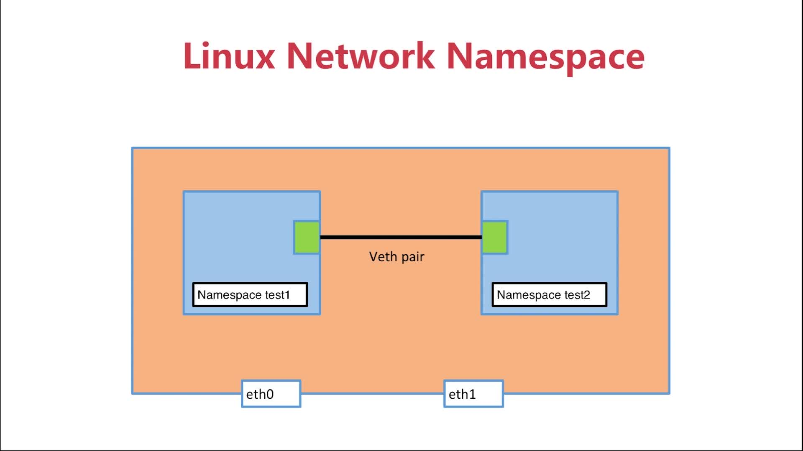
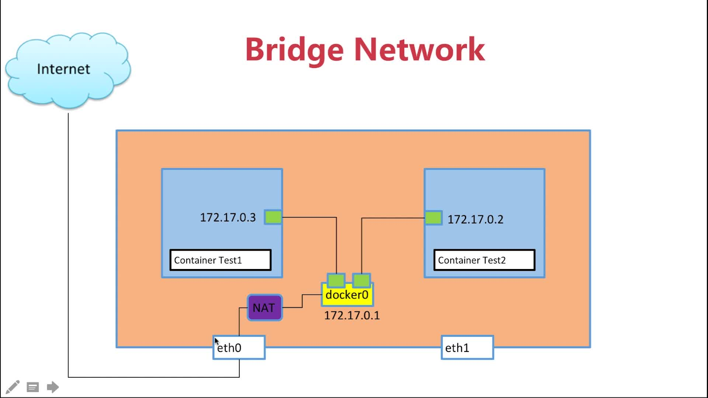
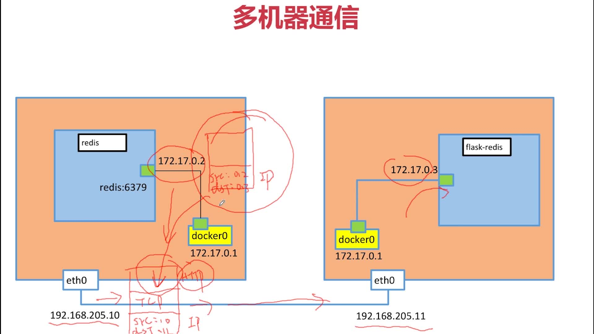
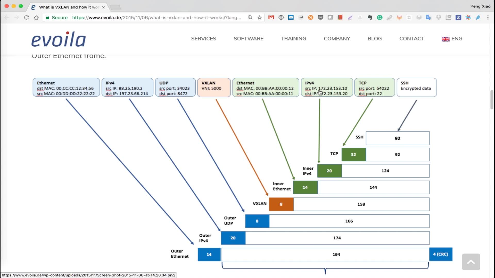

# Docker之间的网络

## 4-3 Linux命名空间

### Docker所用的基础Linux网络namespace 

+ `sudo ip netns list` 列出当前机器的namespace
+ `sudo ip netns add sir1` 向本地机器添加一个名字叫sir1的namespace
+ `sudo ip netns del sir1`  在本地机器上删除一个名字叫sir1的namespace
+ `sudo ip netns exec sir1 ip a` 查看名字叫做sir1的namespace的本地接口
+ `sudo ip netns exec sir1 link` 查看名字叫做sir1的namespace的本地链路情况

### 容器网络相关命令

+ 查看当前容器的内部网络：`docker exec -it 容器id ip a`
+ 查看当前容器的内部链路情况：`docker exec -it 容器id ip link`

### 容器连接的原理

```shell
Linux network space
ip netns list
ip netns exec test1 ip a
ip netns exec test1 ip link
ip link add veth-test1 type veth peer name veth-test2
ip netns exec test1 ip addr add 192.168.1.1/24 dev veth-test1
ip netns exec test2 ip link set dev veth-test2 up
```



## 4-4 Docker bridge0详解

+ `docker network ls`查看当前容器网络

  ```shell
  ~ docker network ls
  NETWORK ID          NAME                DRIVER              SCOPE
  d4fbf27ee62d        bridge              bridge              local
  cdd4aae5c96b        host                host                local
  12289bcbd3c9        none                null                local
  ```

+ `docker network inspect NETWORK_ID`:查看网络的信息，比如哪些容器在连接这个网络，回显例子如下

  ```shell
  ~ docker network inspect d4fbf27ee62d
  [
      {
          "Name": "bridge",
          "Id": "d4fbf27ee62d12def630d049f020a3fe8d268743af83d4807a9f865d333eb141",
          "Created": "2019-06-18T11:23:57.338996882+08:00",
          "Scope": "local",
          "Driver": "bridge",
          "EnableIPv6": false,
          "IPAM": {
              "Driver": "default",
              "Options": null,
              "Config": [
                  {
                      "Subnet": "172.17.0.0/16"
                  }
              ]
          },
          "Internal": false,
          "Attachable": false,
          "Containers": {
              "6162392d72a04762ef2ee29dc64fdd596e1a9c25b6790351ca3e32044fe6f704": {
                  "Name": "r-network-services-metadata-2-036a641b",
                  "EndpointID": "e6919a66d815fd051819d36fc0bc3258f96a706bdc27f0d2e7679a53b60d5e7d",
                  "MacAddress": "02:21:7b:ea:04:a8",
                  "IPv4Address": "172.17.0.5/16",
                  "IPv6Address": ""
              },
              "73e462a9e5c1e647311fea9c3805be2e853005289f10f32fc3b120158ae3391e": {
                  "Name": "mysql-exam",
                  "EndpointID": "b46bc165db338194114aaaebd7c2d671c5a37a34da1153ea93d0b0a7c4a20cdf",
                  "MacAddress": "02:42:ac:11:00:03",
                  "IPv4Address": "172.17.0.3/16",
                  "IPv6Address": ""
              },
              "d7cd19ea69ffe16933fef4f79e5aa01fdd00af456ae8cf058edda21502d4336d": {
                  "Name": "kickass_wescoff",
                  "EndpointID": "574c92eef1ab03c25bf9a1244071becada7bbe216f91f037f9dc1ff558567dad",
                  "MacAddress": "02:42:ac:11:00:04",
                  "IPv4Address": "172.17.0.4/16",
                  "IPv6Address": ""
              }
          },
          "Options": {
              "com.docker.network.bridge.default_bridge": "true",
              "com.docker.network.bridge.enable_icc": "true",
              "com.docker.network.bridge.enable_ip_masquerade": "true",
              "com.docker.network.bridge.host_binding_ipv4": "0.0.0.0",
              "com.docker.network.bridge.name": "docker0",
              "com.docker.network.driver.mtu": "1500"
          },
          "Labels": {}
      }
  ]
  ```

+ brctl:查看桥接网络的工具,对查看容器网络很有用，bridge control，可以用`yum install bridge-utils`来安装
  + `brctl show`:查看当前的桥接网络

    ```shell
    ~ brctl show
    bridge name     bridge id               STP enabled     interfaces
    docker0         8000.0242c6b40778       no              veth3d5652d
                                                            veth59d16b2
                                                            vethd00045b
                                                            vethr0d37319229
                                                            vethr9349990d4f
    ```

+ bridge0的作用
  + 
  + 总结1，所有的容器的网络连接都是连接到宿主机的docker0上。然后宿主机上会起一个veth连接到docker0上。然后容器上的veth和宿主机上的veth是一对。这样就实现了容器互通。
  + 总结2.docker0是宿主机上的网桥，docker0又是连接internet的，所以就实现容器访问互联网
  
## 4-5 容器之间的link

> 通过link,各个容器之间连接可以用名称来连接，避免每次容器启动的名称都不一样的问题，例子`--link 容器名或者id`

+ 新建bridge:`docker network create -d bridge mybridge`
+ 将容器连接到mybridge 网络上:`docker network connect mybridge test`
+ 使用自定的bridge网络创建容器:`docker run --network mybridge --name test -d busybox`
+ 查看网络详细信息:`docker network inspect mybridge`

如果容器连接到了用户自己创建的bridge上，那么即使不用link也是可以通过名字相互ping通的

```shell
docker run -d  --name test --link test1  busybox /bin/sh -c "while true; do sleep 3600; done"
docker network create -d bridge mybridge
docker network inspect mybridge
docker network connect mybridge test
docker exec -it test /bin/sh
```

## 4-6 端口映射

`docker run --name web-server -d -p 80:80 nginx`

## 4-7 容器网络之host和none

> host方式表示容器和所在主机的网络完全一致

+ `docker run --network host xxx`:主机网络启动
+ `docker run --network none xxx`:主机网络启动

## 4-8 多容器复杂应用的部署

> 例子见flask-redis-demo文件夹，用到的命令如下

+ 先启动redis服务器：`docker run -d --name redis redis`
+ 切入到flask-redis-demo并执行如下命令：`docker build -t waterknife/flask-redis-demo .`
+ 启动上一步制作的镜像：`docker run -d -p 5000:5000 --link redis --name flask-redis -e REDIS_HOST=redis waterknife/flask-redis-demo`

## 4-9 多机容器间的通信：Overlay和Underlay的通俗解释

两个不同公网ip的机器上的容器直接通信是不行地，但是可以通过在主机socket包中携带容器的数据包，到目标机器上再解包，从而实现不同机器上的容器通信。这个功能相当于一个隧道，官方名称VXLAN



VALAN原理图如下：



## 4-10 多机通信实战

+ 1、分别在两个节点上安装etcd cluster, 检查ectd的健康状态
+ 2、分别在两个节点上重启docker服务，重启的时候参数里配置cluster分布式共享存储，重启之后就有共享存储了
+ 3、在其中一个节点创建一个overlay类型的demo网络，在另一个节点上也能发现
+ 4、分别将各自节点上的应用通过--net demo参数启动镜像，都添加到demo里，两个各自节点上的应用就能互相通信了
