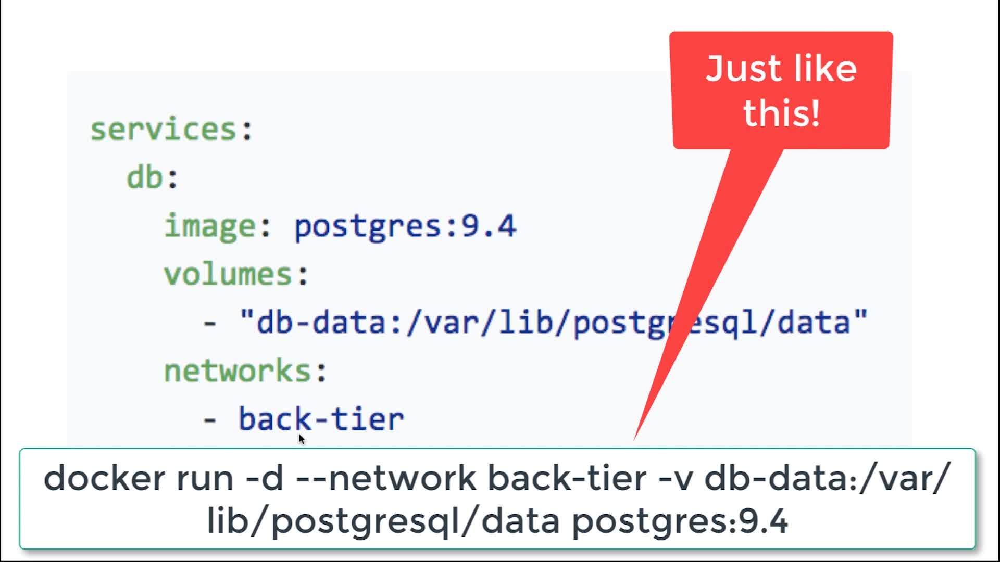
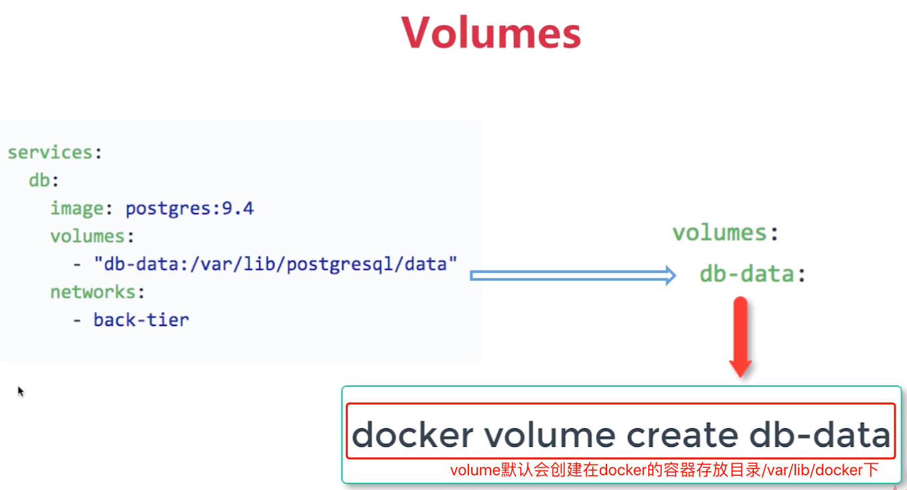
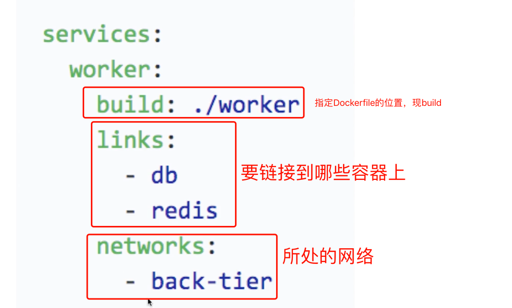

# Docker Compose

## 6-1 以wordpress构建博客为例讲解docker-compose

### 1.创建mysql容器

`docker run --name mysql5.7 -v mysql-data:/var/lib/mysql -p 3306:3306 -e MYSQL_ROOT_PASSWORD=root -e MYSQL_DATABASE=wordpress -d mysql:5.7.15`

### 2.连接wordpress

`docker run -d --name mywordpress -e WORDPRESS_DB_HOST=mysql5.7:3306 --link mysql5.7:mysql -e WORDPRESS_DB_USER=root -e WORDPRESS_DB_PASSWORD=root -p 8080:80 wordpress`

## 6-2 Docker Compose概念

> Docker Compose的V2和V3版本的区别：V2只能用于单机,V3可以用于多机。Rancher1.x目前只支持V2，Rancher2.x不知道咋样

### 安装

[参考教程](https://github.com/19920625lsg/docker-k8s-devops/blob/master/EasyMock/easymock/README.md#2安装docker-compose)

### 组成

+ **Services**:一个service代表一个container.可以从dockerhub的image来创建，或者从本地的Dockerfile build出来的Image来创建.还可以单独制定network和volume
+ **Networks**:桥接、网络等
+ **Volumes**:路径挂载

例子如下：

+ docker-compose组成
  
+ volume详解
  
+ networks详解
  

### 常用命令

+ `docker-compose build`:先把需要的镜像都build出来。up的时候如果镜像没有也会先build.不过最好还是先build再up
  + 
+ `docker-compose up -d`:后台启动服务
+ `docker-compose down`:停止服务并删除镜像
+ `docker-compose up --scale service服务=10 -d`:--scale表示启动10个相同服务，可以用来做水平扩展.见范例falsk-redis

### 利用haproxy实现负责均衡

> 见范例lb-proxy,cd到这个目录，然后执行如下操作

+ `docker-compose up -d`
+ `docker-compose up --scale web=3 -d`
+ 去浏览器访问`localhost:8080`可以看到在3个web服务器之间进行了轮询
+ `docker-compose up --scale web=2 -d`：可以自动进行缩容，随机关闭一个web.--scale指定实例的个数

haproxy容器通过--link对三个web容器进行了代理，而不需要三个被代理的容器都对外开放80端口(-p映射出来80端口反而会引起端口冲突)。

```Dockerfile
lb:
    image: dockercloud/haproxy
    links:
      - web
    ports:
      - 8080:80
    volumes:
      - /var/run/docker.sock:/var/run/docker.sock
```
