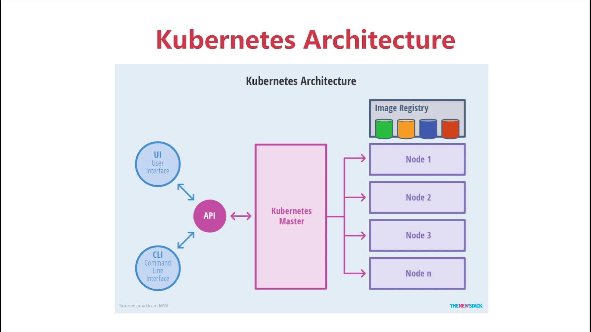
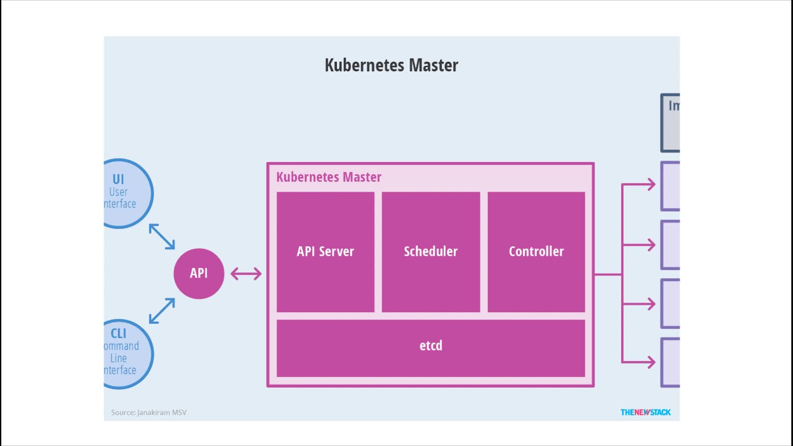
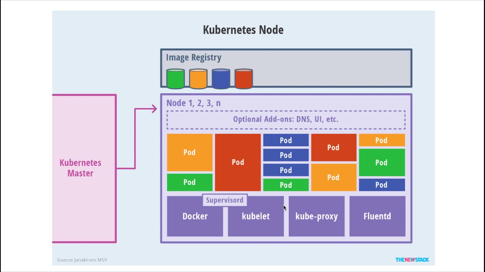
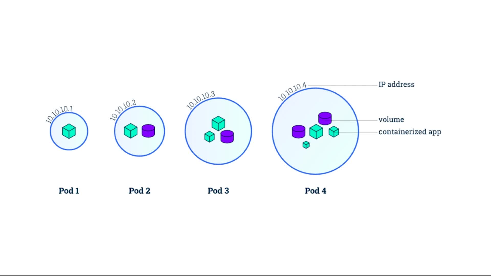

# 第9章 Kubernetes 学习

## 9.1 K8s简介

### 9.1.1 基本架构：Master+多个Node



### 9.1.2 Master节点详解



### 9.1.3 Node节点详解

Pod:具有相同namespace的一组容器的组合，一般是一组功能依赖的容器



## 9.2 Minikube快速搭建K8S单节点环境

### 搭建环境

#### 单节点，采用[minikube](https://github.com/kubernetes/minikube) 

+ `kubectl config`:查看k8s节点配置
+ `kubectl config view`:查看节点配置
+ `kubectl config get-contexts`:获取上下文信息
+ `kubectl cluster-info`:获取集群节点信息

+ `minicube version`可以查看版本号
+ `minikube start`:启动minikube
+ `minikube ssh`:连接minikube虚拟机(运行在virtulbox中)

## 9.3 K8S最小调度单元Pod

> Pod:具有相同namespace的一组容器的组合，一般是一组功能依赖的容器，Pod的图示如下，



```shell
kubectl create -f pod.yml # 创建pod
kubectl delete -f pod.yml # 删除pod
kubectl get pods # 查看当前的Pod列表
kubectl get pods -o wide # 查看pod的详细信息
kubectl exec -it nginx sh # 默认连接第一个容器，可以使用 -c 指定连接哪个容器
kubectl describe pods nginx # 查看pods详情
kubectl port-forward nginx 8080（本地端口）:80（容器中端口）#  端口转发 ，临时 退出后失效
```

## 9.4 ReplicaSet和ReplicationController

Kubernetes Replication Controller：
ReplicationController（简称RC）是确保用户定义的Pod副本数保持不变。
在用户定义范围内，如果pod增多，则ReplicationController会终止额外的pod，如果减少，RC会创建新的pod，始终保持在定义范围。
ReplicationController会替换由于某些原因而被删除或终止的pod，例如在节点故障或中断节点维护（例如内核升级）的情况下。
即使应用只需要一个pod，我们也建议使用ReplicationController。
RC跨多个Node节点监视多个pod。

删除ReplicationController及其Pods：
使用kubectl delete命令删除ReplicationController及其所有pod。
只删除 ReplicationController：
在删除ReplicationController时，可以不影响任何pod。
使用kubectl，为kubectl delete指定- cascade = false选项。
ReplicationController隔离pod：
通过更改标签来从ReplicationController的目标集中删除Pod。

RC常用方式：
Rescheduling（重新规划）
扩展
滚动更新
多版本跟踪
使用ReplicationControllers与关联的Services

API对象：
Replication controller是Kubernetes REST API中的顶级资源。
RC 替代方法：
ReplicaSet：
ReplicaSet是支持新的set-based选择器要求的下一代ReplicationController 。
主要用作Deployment协调pod创建、删除和更新。请注意，除非需要自定义更新编排或根本不需要更新，否则建议使用Deployment而不是直接使用ReplicaSets。
Deployment（推荐）：
Deployment是一个高级的API对象，以类似的方式更新其底层的副本集和它们的Pods kubectl rolling-update。
Bare Pods：
与用户直接创建pod的情况不同，ReplicationController会替换由于某些原因而被删除或终止的pod，例如在节点故障或中断节点维护（例如内核升级）的情况下。
即使应用只需要一个pod，我们也建议使用ReplicationController。

Kubernetes Replica Sets：
ReplicaSet（RS）是Replication Controller（RC）的升级版本。
ReplicaSet 和  Replication Controller之间的唯一区别是对选择器的支持。
ReplicaSet支持labels user guide中描述的set-based选择器要求
Replication Controller仅支持equality-based的选择器要求。


大多数kubectl 支持Replication Controller 命令的也支持ReplicaSets。
ReplicaSets可以独立使用，但它主要被 Deployments用作pod 机制的创建、删除和更新。
使用Deployment时，你不必担心创建pod的ReplicaSets，因为可以通过Deployment实现管理ReplicaSets。
ReplicaSet能确保运行指定数量的pod。
Deployment 是一个更高层次的概念，它能管理ReplicaSets，并提供对pod的更新等功能。
建议使用Deployment来管理ReplicaSets，除非你需要自定义更新编排。

ReplicaSet as an Horizontal Pod Autoscaler target：
ReplicaSet也可以作为 Horizontal Pod Autoscalers (HPA)的目标 。
一个ReplicaSet可以由一个HPA来自动伸缩。

## 9.5 Deployment

> Deployment—**更加方便**的管理Pod和Replica Set

参考博文 [ReplicationController,Replica Set,Deployment区别](https://www.cnadn.net/post/2335.htm)

### 9.6 多节点集群，采用[kubeadm](https://github.com/kubernetes/kubeadm)

### 在cloud上安装k8s集群，用[kops](https://github.com/kubernetes/kops)
