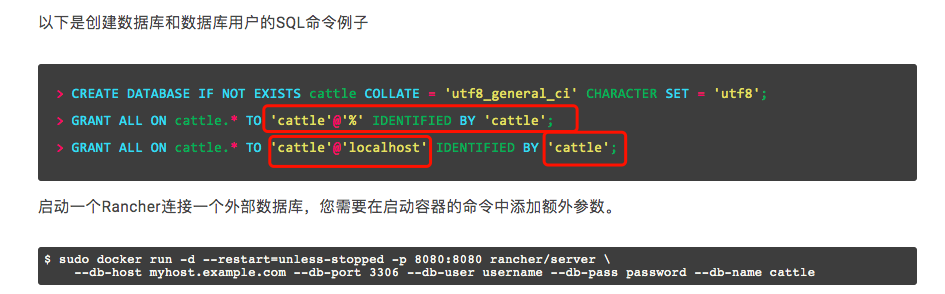
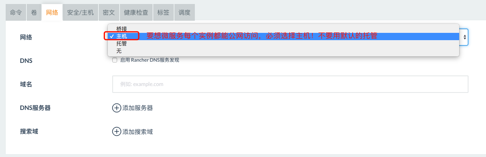
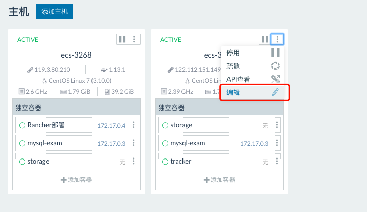
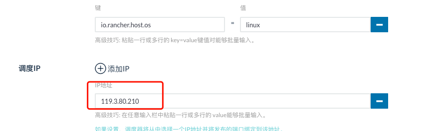
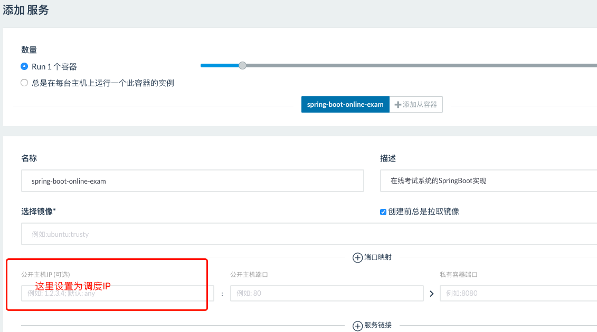

# Rancher+微服务

## 参考教程

+ [官方教程](https://www.cnrancher.com/docs/rancher/v1.x/cn/installing/installing-server/#single-container)
+ [慕课网教程](https://coding.imooc.com/lesson/187.html#mid=12896)
+ [51CTO教程](https://edu.51cto.com/center/course/lesson/index?id=323724)

## 安装

+ 内嵌数据库：`sudo docker run -d --restart=unless-stopped -p 8080:8080 rancher/server`
+ 外接数据库：`docker run -d --restart=unless-stopped -p 8080:8080 rancher/server --db-host 122.112.151.149 --db-port 3306 --db-user root --db-pass aA111111 --db-name cattle`

## 常见问题和注意事项

### 1.外接数据库时的命令必须根据上面教程里的适配自己客户端的用户名和密码，要不连不上数据库地

> 最好设置成和数据库server一样的用户名和密码

### 2.想让启动的微服务实例能在内网内访问，网络必须选择"主机"而不是默认的"托管"

### 3.要是想指定ip调度，需要先给资源添加调度IP，然后再创建服务时指定ip调度

#### 4.本地的IDEA或者PyCharm想连接Linux上的Docker，进行远程打包和部署

参考教程 [Idea连接服务器docker并部署代码到docker实现一键启动](https://www.cnblogs.com/hsz-csy/p/9488469.html)
