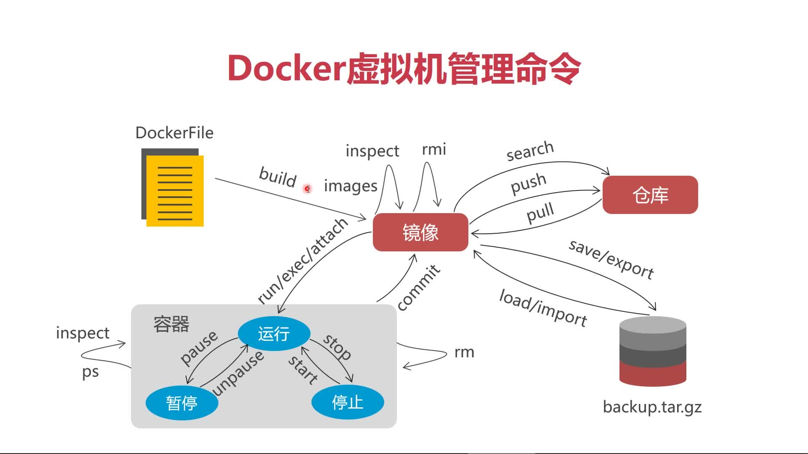

# 第3章 Linux基础知识强化

## 3.3 防火墙管理

## CentOS7 防火墙

+ CentOS7默认安装了firewalld防火墙
+ 利用防火墙，我们可以允许或是限制传输的数据通过，防火墙一般按照端口粒度进行管理
  > 程序<--->防火墙<-->互联网

### 管理防火墙

+ 查看：`firewall-cmd --state`
+ 启动：`service firewall start` 或者 `systemctl start firewall`
+ 停止：`service firewall stop`  或者 `systemctl stop firewall`
+ 重启：`service firewall restart` 或者 `systemctl restart firewall`
+ 禁用：`service firewall disable` 或者 `systemctl disable firewall`
+ 端口管理
  + 查看开放的端口：`firewall-cmd --permanent --list-ports`
  + 查看开放的服务：`firewall-cmd --permanent --list-services`
  + 添加开放端口：`firewall-cmd --permanent --add-port=8080-8085/tcp`
  + 移除开放端口：`firewall-cmd --permanent --remove-port=8080-8085/tcp`
  + 刷新防火墙：`firewall-cmd reload`
  
### docker管理

+ 刷新守护进程: `systemctl daemon-reload`
+ 重启：`systemctl restart docker` 或者 `service docker restart`
+ 停止：`service docker stop` 或者 `systemctl stop docker`

### docker命令

