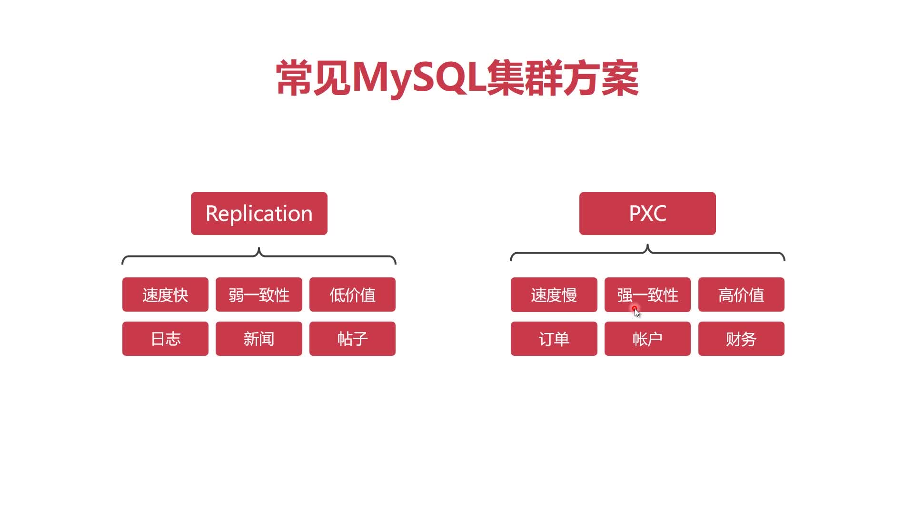
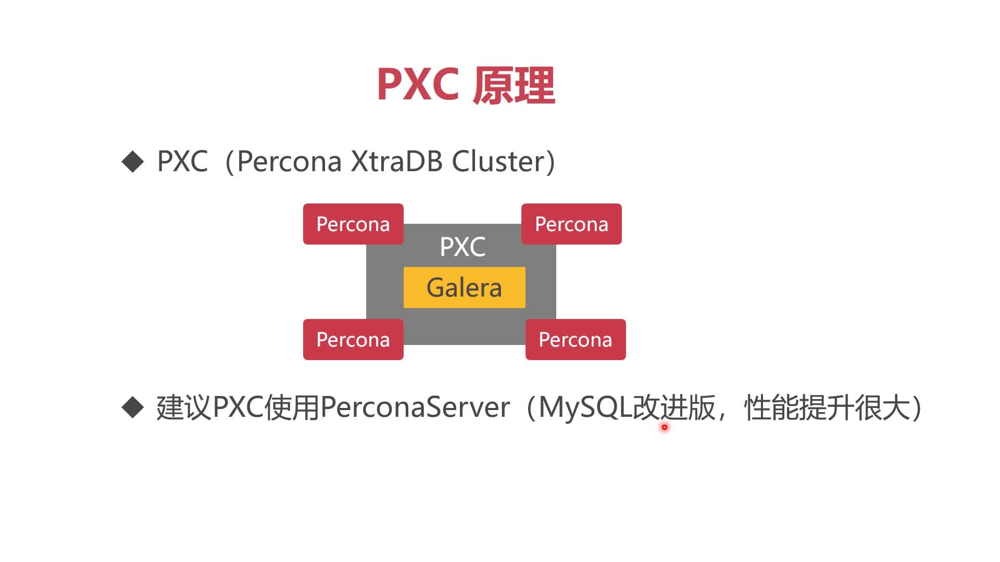
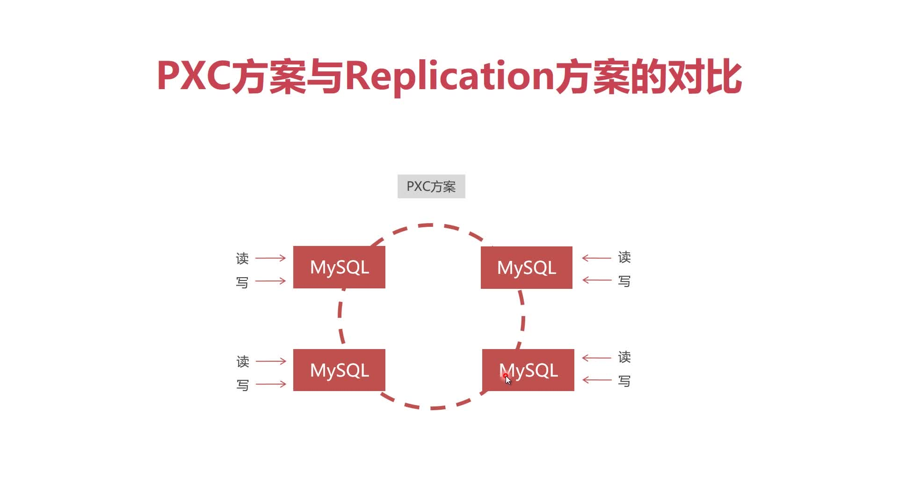
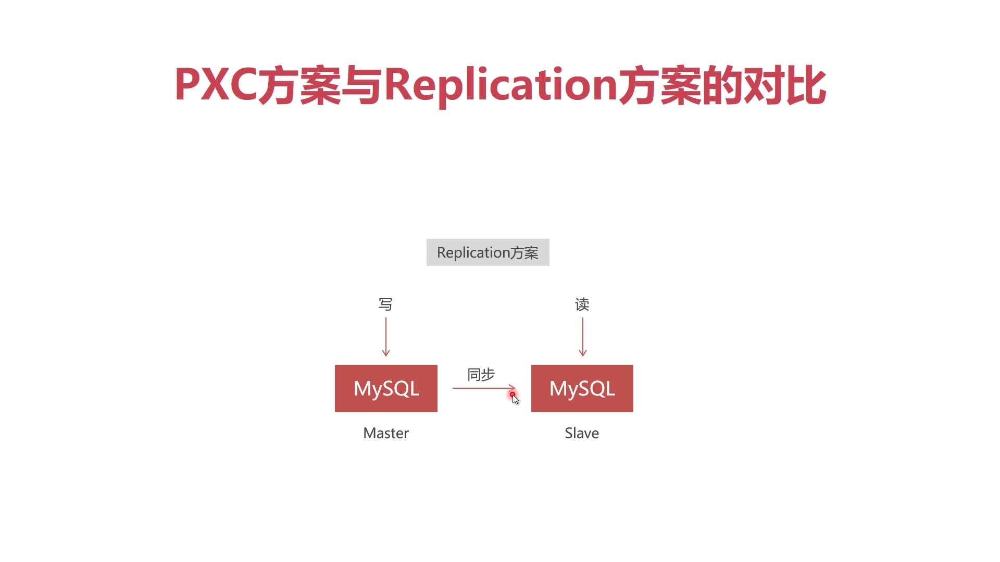
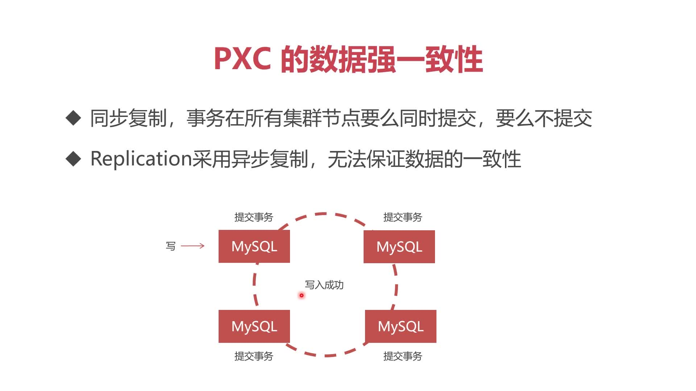
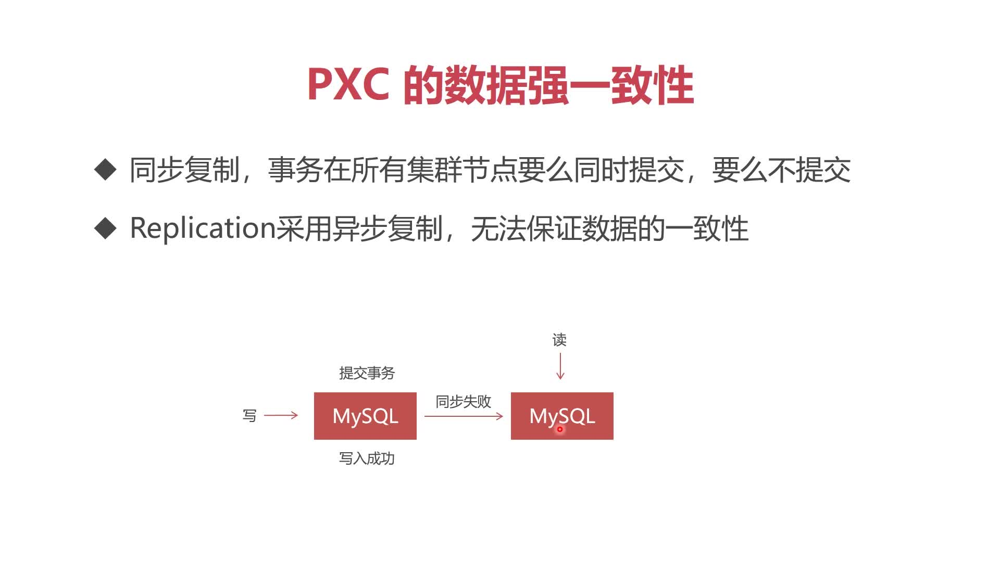
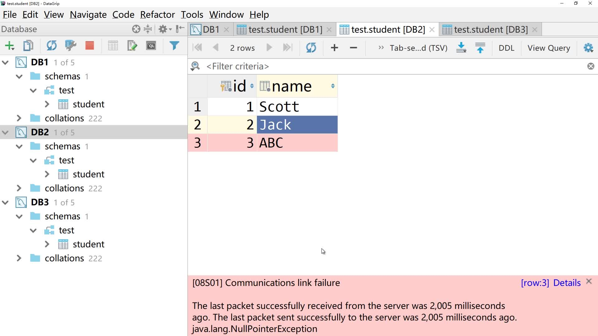

# 4.1 MySQL集群方案介绍

## 常见的mysql集群方案

+ **Replication**：速度快、弱一致性、低价值、适合保存日志新闻和帖子
+ **PXC**：Percona XtraDB Cluster,速度慢，强一致性，高价值适合保存订单账户财务信息。**推荐用此方案**

## PXC原理

## PXC方案与Replication方案的对比

+ PXC方案示意图
  

+ Replication方案对比
  

## PXC方案的数据强一致性

+ **PXC**：**同步复制**,事务在所有集群节点要么同时提交，要么不提交
  
+ **Replication**：**异步复制**，无法保证数据的一致性
  

## PXC方案强一致性的案例

> 图中的节点被认为关闭防火墙，直接与数据库其他节点同步，会发现此时这个节点写入数据会直接报错~如下图

