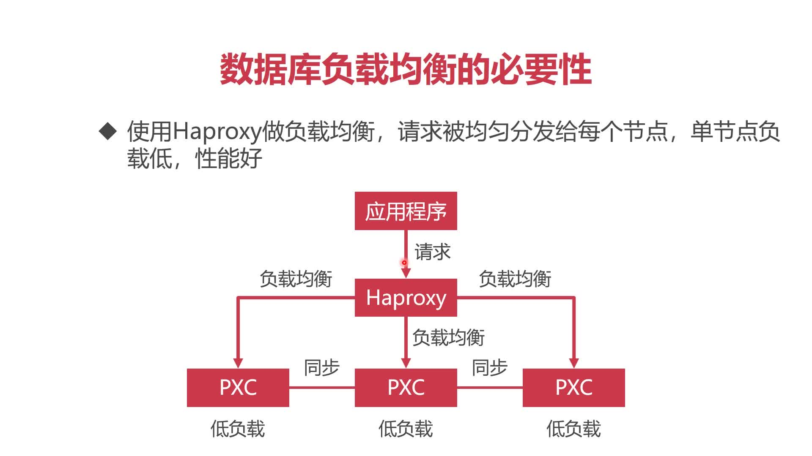
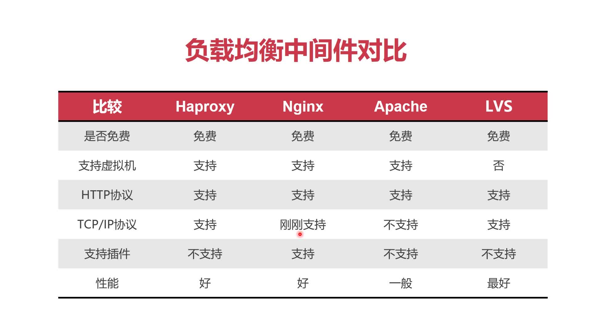

# 4-3_HAProxy实现数据库负载均衡

## HAProxy实现负载均衡的原理图



## 负载均衡中间件的对比

> 数据库多节点的同步用地协议是TCP/IP

+ 不用nginx的原因：刚刚支持TCP/IP协议，对于数据库同步支持不好
+ 不用Apache的原因:不支持TCP/IP协议
+ 不用LVS的原因：不支持在虚拟机里使用，不方便学习
+ 使用HAProxy的原因：对TCP/IP的支持好，有官方的Docker镜像，方便学习



## 使用HAProxy进行数据库的负载均衡

### 1.准备hasproxy的镜像

```shell
docker pull haproxy
```

### 2.自定义配置文件

`touch /usr1/l00379880/haproxy/haproxy.cfg`,配置文件的教程参考: https://zhangge.net/5125.html ，典型的配置文件内容如下：

```haproxy
global
    #工作目录
    chroot /usr/local/etc/haproxy
    #日志文件，使用rsyslog服务中local5日志设备（/var/log/local5），等级info
    log 127.0.0.1 local5 info
    #守护进程运行
    daemon

defaults
    log global
    mode http
    #日志格式
    option httplog
    #日志中不记录负载均衡的心跳检测记录
    option dontlognull
    #连接超时（毫秒）
    timeout connect 5000
    #客户端超时（毫秒）
    timeout client  50000
    #服务器超时（毫秒）
    timeout server  50000

#监控界面
listen  admin_stats
    #监控界面的访问的IP和端口
    bind  0.0.0.0:8888
    #访问协议
    mode        http
    #URI相对地址
    stats uri   /dbs
    #统计报告格式
    stats realm     Global\ statistics
    #登陆帐户信息
    stats auth  root:tooldev
#数据库负载均衡
listen  proxy-mysql
    #访问的IP和端口
    bind  0.0.0.0:3306  
    #网络协议
    mode  tcp
    #负载均衡算法（轮询算法）
    #轮询算法：roundrobin
    #权重算法：static-rr
    #最少连接算法：leastconn
    #请求源IP算法：source 
    balance  roundrobin
    #日志格式
    option  tcplog
    #在MySQL中创建一个没有权限的haproxy用户，密码为空。Haproxy使用这个账户对MySQL数据库心跳检测
    option  mysql-check user haproxy
    server  MySQL_1 10.162.119.41:3306 check weight 1 maxconn 2000  
    server  MySQL_2 10.162.71.9:3306 check weight 1 maxconn 2000  
    server  MySQL_3 10.162.55.14:3306 check weight 1 maxconn 2000 
    #使用keepalive检测死链
    option  tcpka  
```

创建haproxy心跳检测用户(在任何一个数据库节点上启动均可)

```shell
create user 'haproxy'@'%' identified by '';
```

找一台新的VM，然后执行docker命令

```shell
docker run -it -d -p 80:8888 -p 3306:3306 -v /usr1/l00379880/haproxy:/usr/local/etc/haproxy --name haproxy --privileged --net=net1 haproxy
```

80代表web访问的地址，可以看到数据库集群的实时情况，3306是对外的统一MySQL连接端口，

进入后台docker进程

```shell
docker exec -it haproxy bash
```

启动haproxy进程

```shell
haproxy -f /usr/local/etc/haproxy/haproxy.cfg
```

然后可通过80端口访问PXC集群的监控，可以通过3306端口进行数据库的连接
