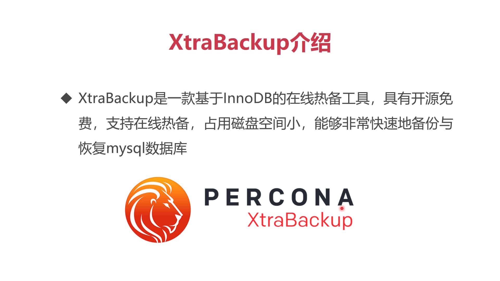
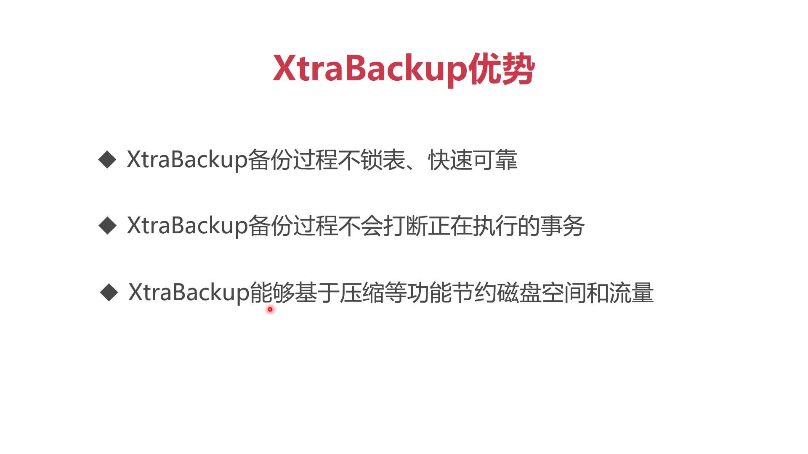

# 4.4 数据库热备份

> 只考虑XtraBackup即可，支持全量备份和增量备份,一般一周一次全量备份，一天一次增量备份

+ 热备份：数据库在运行过程中备份，正常的查询和提交等事务都不影响
+ 冷备份：数据库必须停掉，然后拷贝数据库文件进行备份




## PXC全量备份步骤

```shell
apt-get install keepalived
apt-get install percona-xtrabackup-24 # 回家自己在PXC容器内安装上，然后提交到自己的Dockerhub里去
innobackupex --user=root --password=abc123456 /data/backup/full
```
