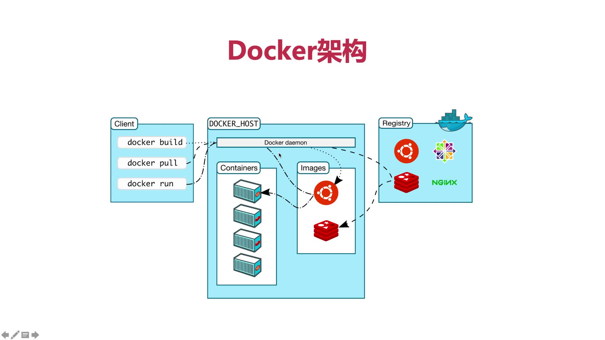
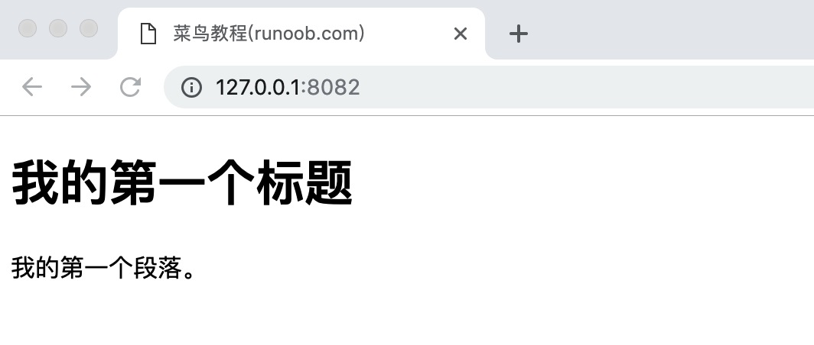

# 第2章 docker基本使用

+ [Docker命令大全](https://www.runoob.com/docker/docker-command-manual.html)
+ [Docker资源汇总](https://www.runoob.com/docker/docker-resources.html)

## docker基本架构



## 登入与登出

### docker login 

> 登陆到一个Docker镜像仓库，如果未指定镜像仓库地址，默认为官方仓库 Docker Hub, 格式`docker login [OPTIONS] [SERVER]`


### docker logout

> 登出一个Docker镜像仓库，如果未指定镜像仓库地址，默认为官方仓库 Docker Hub `docker logout [OPTIONS] [SERVER]`


### OPTIONS说明：

+ `-u` :登陆的用户名
+ `-p` :登陆的密码

### 示例

登录dockerhub

```shell
docker login -u 用户名 -p 密码
```

登录阿里云docker仓库

```shell
docker login -u 用户名 -p 密码 registry.cn-hangzhou.aliyuncs.com
```

### 退出dockerhub

```shell
docker logout
```

## docker build自己的镜像

> 见[docker_demo](docker_demo)

## docker的帮助查看

> 任何命令想不起来时都可以通过`--help`来查看帮助

```bash
[root@SZV1000302643 demo2]# docker stats --help

Usage:  docker stats [OPTIONS] [CONTAINER...]

Display a live stream of container(s) resource usage statistics

  -a, --all          Show all containers (default shows just running)
  --help             Print usage
  --no-stream        Disable streaming stats and only pull the first result

[root@SZV1000302643 demo2]# docker rmi --help

Usage:  docker rmi [OPTIONS] IMAGE [IMAGE...]

Remove one or more images

  -f, --force        Force removal of the image
  --help             Print usage
  --no-prune         Do not delete untagged parents
[root@SZV1000302643 demo2]#
```

## 查看容器日志

+ `docker logs 容器id`:查看瞬时的容器内的标准输出
+ `docker logs -f 容器id`:可以持续查看容器内部的标准输出(比如有些程序是持续运行地，`-f` 让 docker logs 像使用 tail -f 一样来输出容器内部的标准输出)

## 查看容器进程

> `docker top 容器id或name`

## 查看容器的详细信息

> `docker inspect 容器id或name`

## 镜像的查看和修改

> 见教程 https://www.runoob.com/docker/docker-image-usage.html

### 对修改后的容器保存为新的镜像

> docker commit -m='create index.html' -a='l00379880' 0a6389dbe443 l00379880/ubuntu:v587

各个参数说明：

+ `-m`:提交的描述信息
+ `-a`:指定镜像作者
+ `0a6389dbe443`：容器ID
+ `l00379880/ubuntu:v587`:指定要创建的目标镜像名

用docker images可以查看刚刚提交的新镜像

## Docker搭建常用的开发环境

### 1.搭建nginx [参考教程](https://www.runoob.com/docker/docker-install-nginx.html)

`$ docker run -d -p 8082:80 --name runoob-nginx-test-web -v ~/nginx/www:/usr/share/nginx/html -v ~/nginx/conf/nginx.conf:/etc/nginx/nginx.conf -v ~/nginx/logs:/var/log/nginx nginx`

命令说明：

+ `-p 8082:80`： 将容器的 80 端口映射到主机的 8082 端口
+ `--name runoob-nginx-test-web`：将容器命名为 runoob-nginx-test-web。
+ `~/nginx/www:/usr/share/nginx/html`：将我们自己创建的 www 目录挂载到容器的 **/usr/share/nginx/html**，这个是nginx的对外访问目录
+ `-v ~/nginx/conf/nginx.conf:/etc/nginx/nginx.conf`：将我们自己创建的 nginx.conf 挂载到容器的 /etc/nginx/nginx.conf。
+ `-v ~/nginx/logs:/var/log/nginx`：将我们自己创建的 logs 挂载到容器的 /var/log/nginx。

**默认的nginx.conf的内容如下**：

```nginx

user  nginx;
worker_processes  1;

error_log  /var/log/nginx/error.log warn;
pid        /var/run/nginx.pid;


events {
    worker_connections  1024;
}


http {
    include       /etc/nginx/mime.types;
    default_type  application/octet-stream;

    log_format  main  '$remote_addr - $remote_user [$time_local] "$request" '
                      '$status $body_bytes_sent "$http_referer" '
                      '"$http_user_agent" "$http_x_forwarded_for"';

    access_log  /var/log/nginx/access.log  main;

    sendfile        on;
    #tcp_nopush     on;

    keepalive_timeout  65;

    #gzip  on;

    include /etc/nginx/conf.d/*.conf;
}
```

启动以上命令后进入 ~/nginx/www 目录 `$ cd ~/nginx/www`,创建index.html,内容如下：

```html
<!DOCTYPE html>
<html>
<head>
<meta charset="utf-8">
<title>菜鸟教程(runoob.com)</title>
</head>
<body>
    <h1>我的第一个标题</h1>
    <p>我的第一个段落。</p>
</body>
</html>
```

然后访问`本机ip:8082`即可访问刚刚创建的index.html了



### 2.安装mysql

> docker run -p 3306:3306 --name mysql-demo1 -v $PWD/data:/var/lib/mysql -e MYSQL_ROOT_PASSWORD=aA111111 -d mysql:5.7.15

+ `-p 本机端口:容器内端口`实现内外的端口映射，当不想自己指定时直接用`-P`来代替，会自动占用主机上的一个`高端口`(一般是32768~65536)来映射容器的端口
+ `-e`:Enviroment环境变量
+ `-d`:daemon 后台运行
+ `-v`:volume 存储卷

安装mysql的8.x版本需要额外加权限

```Dockerfile
# docker 中下载 mysql
docker pull mysql

#启动
docker run --name mysql -p 3306:3306 -e MYSQL_ROOT_PASSWORD=Lzslov123! -d mysql

#进入容器
docker exec -it mysql bash

#登录mysql
mysql -u root -p
ALTER USER 'root'@'localhost' IDENTIFIED BY 'Lzslov123!';

#添加远程登录用户
CREATE USER 'liaozesong'@'%' IDENTIFIED WITH mysql_native_password BY 'Lzslov123!';
GRANT ALL PRIVILEGES ON *.* TO 'liaozesong'@'%';
```

### 3.使用tomcat

> `docker run --name tomcat -p 8080:8080 -v $PWD/test:/usr/local/tomcat/webapps/test -d tomcat`

+ `-p 8080:8080`：将容器的8080端口映射到主机的8080端口
+ `-v $PWD/test:/usr/local/tomcat/webapps/test`：将主机中当前目录下的test挂载到容器的/test

然后在$PWD/test下创建index.html

```html
hello l00379880
```

这是访问`ip:8080/test`即可访问上面创建的html文件了

### 4.使用python3.7

首先在`~/python/myapp`目录下创建helloworld.py,内容如下：

```python
#!/usr/bin/python
print("Hello, World!");
```

然后执行docker命令使用python3.7的镜像来执行上面的py脚本即可

```shell
docker run  -v ~/python/myapp:/usr/src/myapp  -w /usr/src/myapp python:3.7 python helloworld.py
```

输出`Hello, World!`,正常运行！

命令说明：

+ `-v $PWD/myapp:/usr/src/myapp` :将主机中当前目录下的myapp挂载到容器的`/usr/src/myapp`
+ `-w /usr/src/myapp` :指定容器的/usr/src/myapp目录为工作目录
+ `python helloworld.py` :使用容器的python命令来执行工作目录中的helloworld.py文件

### 5.使用redis

```shell
mkdir -p ~/redis/data
docker run -p 6379:6379 -v ~/redis/data:/data  -d redis:3.2 redis-server --appendonly yes
docker exec -it 8b95a955f23f redis-cli
set hello world # 返回"ok"
get hello # 返回"world"
```

### 6.使用mongo

```shell
mkdir -p ~/mongo/db
docker run -p 27017:27017 -v ~/mongo/db:/data/db -d mongo:3.2
docker run -it mongo:3.2 mongo --host 10.162.118.225 # 这里的ip是容器所在VM的公网ip
```

### 7.使用apache

```shell
mkdir -p /root/apache/www/
mkdir -p /root/apache/logs/
cd /root/apache/www/
echo "hello hahaha">index.html
docker run -p 80:80 -v /root/apache/www/:/usr/local/apache2/htdocs/ -v /root/apache/logs/:/usr/local/apache2/logs/ -d httpd
```

然后访问`ip:80`即可看到`hello hahaha`
