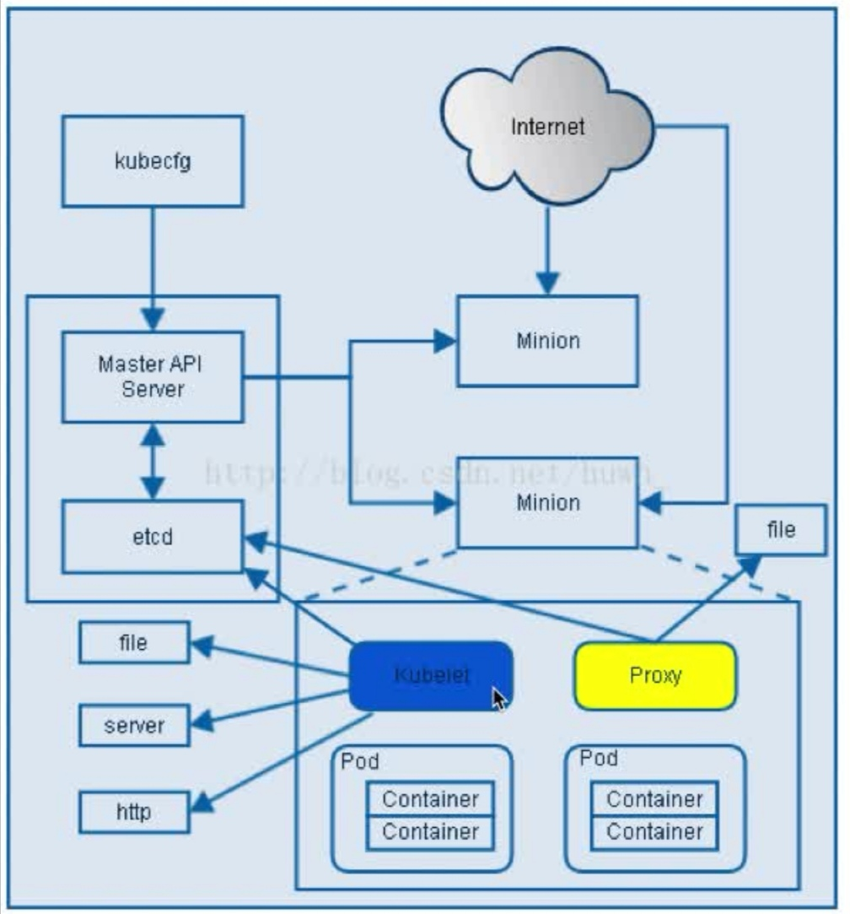

# 第3章 必知必会的k8s

## k8s是什么

 > Kubernetes 是 Google 开源的一个容器编排引擎,它支持自动化部署、大规模可伸缩、应用容器化管理

## k8s能做什么

+ 容器的自动化复制和部署,随时扩展或收缩容器规模,并提供负载均衡
+ 方便地容器升级
+ 提供容器弹性,如果失效就替换它

## k8s对于测试能做什么

+ 测试服务器的集中化、自动化管理。将各种平台的服务器加入集群,按需部署或销毁
+ 持续集成时方便地自动部署

## k8s架构

> 

+ Master是主服务器，node是用于部署应用容器的服务器
+ Pod是基本操作单元，也是应用运行的载体。整个Kubernetes系统都是围绕着Pod展开地，比如如何部署运行Pod、如何保证Pod的数量、如何访问Pod等
+ Deployment定义了Pod部署的信息
+ 若干个Pod副本组成一个Service,对外提供服务
+ 副本是指一个Pod的多个实例
+ Namespace用于多租户的资源隔离。在测试环境中可以根据namespace划分成多套测试环境。默认有2个namespace:kube-system/default

## k8s调度流程

+ Kubernetes Client将请求发送给API server
+ API server根据请求的类型，将处理的结果存入高可用键值存储系统Etcd中
+ Scheduler将未分发的Pod绑定(bind)到可用的Node节点上，存到etcd中
+ Controller Manager根据etcd中的信息，调用node中kubelet创建pod
+ Controller Manager监控pod的运行状况并确保运行正常

## k8s安装流程

+ 安装docker
+ 安装kubeadm、kubelet和kubectl
