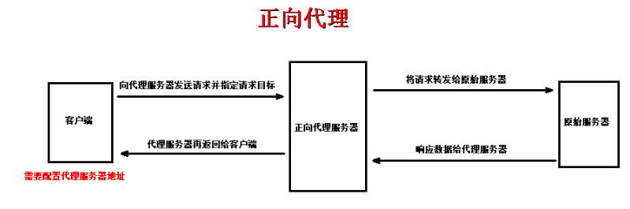
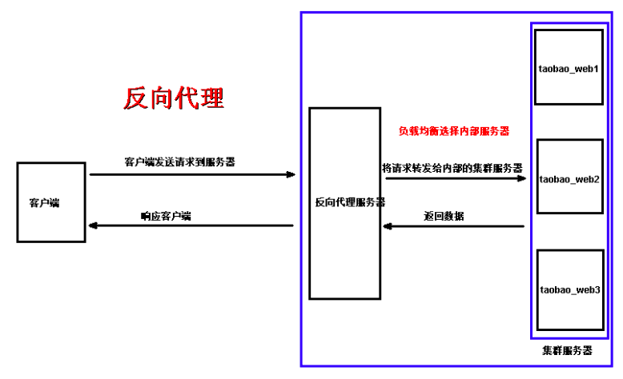

# Nginx快速入门

> [课程地址](https://edu.51cto.com/course/14606.html)

## 1.常用链接

+ [nginx官方稳定版本下载](http://nginx.org/en/download.html)
+ [nginx全版本下载](https://github.com/nginx/nginx/releases) 
+ [nginx官网](http://nginx.org)
+ [nginx中文网](http://www.nginx.cn/doc/)

## 2.Nginx安装

### 2.1 本地安装

见[spring-boot-online-exam/backend/README.md#7配置nginx](https://github.com/19920625lsg/spring-boot-online-exam/blob/master/backend/README.md#7配置nginx)

与下面的课程不同，现在nginx安装完毕，所有的文件都在 **/usr/local/nginx** 下，目录层次如下，下面的教程要**酌情适配**

```shell
[root@heiheihei nginx]# pwd
/usr/local/nginx
[root@heiheihei nginx]# tree ../nginx
../nginx
├── conf
│   ├── fastcgi.conf
│   ├── fastcgi.conf.default
│   ├── fastcgi_params
│   ├── fastcgi_params.default
│   ├── koi-utf
│   ├── koi-win
│   ├── mime.types
│   ├── mime.types.default
│   ├── nginx.conf
│   ├── nginx.conf.default
│   ├── scgi_params
│   ├── scgi_params.default
│   ├── uwsgi_params
│   ├── uwsgi_params.default
│   └── win-utf
├── html
│   ├── 50x.html
│   └── index.html
├── logs
└── sbin
    └── nginx

4 directories, 18 files
```

### 2.2 Docker安装

> :cn:**nginx生产环境不推荐使用容器，因为经常会因为网络和文件、目录权限出各种坑**

[docker-k8s-devops/Jenkins+K8s实现持续集成/第2章_docker基本使用.md#1搭建nginx-参考教程](https://github.com/19920625lsg/docker-k8s-devops/blob/master/Jenkins%2BK8s实现持续集成/第2章_docker基本使用.md#1搭建nginx-参考教程)

创建如下目录：

```shell
[root@heiheihei l00379880]# pwd
/root/heiheihei
[root@heiheihei l00379880]# tree nginx
nginx
├── conf # 文件夹，存放配置文件
│   ├── conf.d # 目录，存放自定义的虚拟主机配置文件
│   │   └── default.conf # 虚拟主机配置，提前把需要的内容写进去，本节有
│   └── nginx.conf # 主配置，提前把需要的内容写进去，本节有
├── logs # 存放日志
└── www # 存放网站
    └── index.html
```

然后在nginx目录下执行如下命令，启动nginx

> docker run -d -p 8888:80 --name nginx-test -v $PWD/www:/usr/share/nginx/html -v $PWD/conf/nginx.conf:/etc/nginx/nginx.conf -v $PWD/conf/conf.d:/etc/nginx/conf.d -v $PWD/logs:/var/log/nginx nginx


## 3.Nginx命令

### 3.1 命令选项

```shell
root@heiheihei:/# nginx -h
nginx version: nginx/1.17.0
Usage: nginx [-?hvVtTq] [-s signal] [-c filename] [-p prefix] [-g directives]

Options:
  -?,-h         : this help 显示帮助
  -v            : show version and exit  显示版本并退出
  -V            : show version and configure options then exit 显示版本和配置选项并退出
  -t            : test configuration and exit 校验配置文件并退出
  -T            : test configuration, dump it and exit 校验配置文件,删除并退出
  -q            : suppress non-error messages during configuration testing 在校验配置文件时，正常的打印给忽略掉
  -s signal     : send signal to a master process: stop, quit, reopen, reload 给nginx发信号，可以停止、退出、重新打开、重新加载nginx进程
  -p prefix     : set prefix path (default: /etc/nginx/) 设置nginx路径前缀
  -c filename   : set configuration file (default: /etc/nginx/nginx.conf) 设置配置文件路径
  -g directives : set global directives out of configuration file 设置独立于配置文件的指令
```

### 3.2 常用命令

```shell
netstat -ntpl | grep 80 #查看进程信息
ps aux | grep ntinx
sudo nginx #启动
sudo nginx -s stop #停止
sudo nginx -s reload #重启
sudo nginx -c /etc/nginx/nginx.conf #使用指定的配置文件启动
sudo nginx -t # 测试配置文件是否有错误
sudo nginx -v #查看版本信息
```

## 4.配置文件详解

### 4.1 最关键的配置文件`/usr/local/nginx/conf/nginx.conf`

主配置文件nginx.conf，包含三部分内容：**全局配置**、**工作模式配置**、**HTTP配置**。文件默认内容如下，

```nginx
user  root;
worker_processes  1;

#error_log  logs/error.log;
#error_log  logs/error.log  notice;
#error_log  logs/error.log  info;

#pid        logs/nginx.pid;


events {
    worker_connections  1024;
}


http {
    include       mime.types;
    default_type  application/octet-stream;

    #log_format  main  '$remote_addr - $remote_user [$time_local] "$request" '
    #                  '$status $body_bytes_sent "$http_referer" '
    #                  '"$http_user_agent" "$http_x_forwarded_for"';

    #access_log  logs/access.log  main;

    sendfile        on;
    #tcp_nopush     on;

    #keepalive_timeout  0;
    keepalive_timeout  65;

    #gzip  on;

    # 引入外部配置文件，包含虚拟主机的设置,一个配置文件就是一个虚拟主机。下面有讲，其实自定义的配置文件都可以放在这个目录下
    include /usr/local/nginx/conf/conf.d/*.conf;
}
```

**各个字段的解析如下：**

```nginx
# 1.全局配置
# 运行root的用户(可以赋予最高权限，不会出现403 Forbidden的情况)
user  root;
# 工作进程的数量，可以根据CPU的核心总数来设置
worker_processes  4;

# 错误日志文件的位置和输出级别
#error_log  logs/error.log;
#error_log  logs/error.log  notice;
#error_log  logs/error.log  info;

# PID文件的位置
#pid        logs/nginx.pid;

# 2.工作模式配置
events {
    # 每个进程最大处理的连接数.总连接数 = worker_processes(CPU核心数) * worker_connections(单CPU进程的最大连接数)
    worker_connections  1024;
}

# 3.HTTP配置
http {
    # 支持的媒体类型.支持的全部媒体类型见/usr/local/nginx/conf/mime.types
    include       mime.types;
    # 默认的类型
    default_type  application/octet-stream;

    # 日志格式
    #log_format  main  '$remote_addr - $remote_user [$time_local] "$request" '
    #                  '$status $body_bytes_sent "$http_referer" '
    #                  '"$http_user_agent" "$http_x_forwarded_for"';
    
    # 访问日志文件的位置
    #access_log  logs/access.log  main;

    # 是否调用sendfile函数来输出文件
    sendfile        on;
    # 是否在一个数据包中发送所有的文件，默认是on
    #tcp_nopush     on;
    
    # 连接超时时间,单位是s，秒
    keepalive_timeout  65;

    # 开启gzip压缩
    #gzip  on;
    
    # 引入外部配置文件，包含虚拟主机的设置,一个配置文件就是一个虚拟主机。下面有讲，其实自定义的配置文件都可以放在这个目录下
    include /usr/local/nginx/conf/conf.d/*.conf;
}
```

### 4.2 自定义配置文件之default.conf

上面的nginx.conf的最后一行配置了会自动引入 **/usr/local/nginx/conf/conf.d** 下面的所有conf配置文件，这个目录下默认有的 **/usr/local/nginx/conf/conf.d/default.conf** 是指**虚拟主机配置文件，可以定义多个虚拟主机配置文件**,默认内容如下

```nginx
server {
    listen       80;
    server_name  localhost;

    #charset koi8-r;

    #access_log  logs/host.access.log  main;

    location / {
        root   html;
        index  index.html index.htm;
    }

    #error_page  404              /404.html;

    # redirect server error pages to the static page /50x.html
    #
    error_page   500 502 503 504  /50x.html;
    location = /50x.html {
        root   html;
    }
}
```

**配置详解如下：**

```nginx
# 虚拟主机的配置
server {
    # 监听端口
    listen       80;
    # 服务器域名
    server_name  localhost;

    # 网页的默认编码
    #charset koi8-r;
    # 访问该虚拟主机的日志位置
    #access_log  logs/host.access.log  main;

    # 根据目录配置，nginx对外的访问目录和首页入口
    location / {
        # 网站根目录的配置
        root   /usr/local/nginx/html;
        # 默认首页
        index  index.html index.htm;
    }

    # 404错误的反馈页面
    #error_page  404              /404.html;

    # 50x错误页面的配置
    # redirect server error pages to the static page /50x.html
    # 50x错误的反馈页面
    error_page   500 502 503 504  /50x.html;
    # 50x错误页面的路径
    location = /50x.html {
        root   /usr/local/nginx/html;
    }
}
```

## 5.虚拟主机

> 把一台物理服务器划分为多个虚拟的服务器，称为虚拟主机。每个虚拟主机对应一个Web站点，其实就是在一台服务器上搭建多个网站

### 5.1 准备网站目录及测试页面

```shell
mkdir www
cd www
mkdir ums
mkdir sms
echo welcome to ums > ums/index.html
echo welcome to sms > sms/index.html
```

### 5.2 创建虚拟主机配置文件并配置

+ 创建ums网站

  ```shell
  cd /usr/local/nginx/conf/conf.d/
  sudo cp default.conf ums.conf
  sudo vi ums.conf
  ```

  ```nginx
  server {
      listen       80;
      server_name  ums.huawei.com;

      location / {
          root   /root/l00379880/nginx/ums;
          index  index.html index.htm;
      }
  }
  ```

+ 创建sms网站

  ```shell
  sudo cp default.conf sms.conf
  sudo vi sms.conf
  ```

  ```nginx
  server {
      listen       80;
      server_name  sms.huawei.com;

      location / {
          root   /root/l00379880/nginx/sms;
          index  index.html index.htm;
      }
  }
  ```
  
### 5.3 实现虚拟主机的三种方式

+ 基于不同的IP
+ 基于不同的端口
+ 基于不同的域名

### 5.4 配置域名解析

在客户端主机中配置域名解析
+ windows：C:\Windows\System32\drivers\etc\hosts
+ Linux/Mac：/etc/hosts

```hosts
10.162.119.133 ums.huawei.com
10.162.119.133 sms.huawei.com
```

域名解析的过程：查找hosts文件——>DNS 
注：该方式仅是本地测试时使用的，实际应用中要购买注册域名

本地访问[ums.huawei.com](http://ums.huawei.com)和[sms.huawei.com](http://sms.huawei.com),可以分别看到网页返回`welcome to ums`和`welcome to sms`

## 6.nginx作为图片服务器

### 6.1 创建需要的目录,并把图片上传上去

```shell
[root@heiheihei nginx]# pwd
/root/l00379880/nginx
[root@heiheihei nginx]# tree images -h
images
└── [ 18K]  girl.png

0 directories, 1 file
```

### 6.2 配置default.conf

```shell
[root@SZV1000302644 conf.d]# ls
default.conf  sms.conf  ums.conf
[root@SZV1000302644 conf.d]# pwd
/usr/local/nginx/conf/conf.d
[root@SZV1000302644 conf.d]# cat default.conf
```

可看到添加图片服务器后的default.conf内容如下：

```nginx
server {
    # 监听端口
    listen       80;
    # 服务器域名
    server_name  localhost;

    # 网页的默认编码
    #charset koi8-r;
    # 访问该虚拟主机的日志位置
    #access_log  /var/log/nginx/host.access.log  main;

    # 根据目录配置，nginx对外的访问目录和首页入口
    location / {
        # 网站根目录的配置
        root   /usr/local/nginx/html;
        # 默认首页
        index  index.html index.htm;
    }

    # 图床配置
    location /images {
        # 一定注意这个目录是images的上一层，这样才能通过"http://ip/images"来访问目录合图片
        root /root/l00379880/nginx;
        autoindex on;
    }

    # 404错误的反馈页面
    #error_page  404              /404.html;

    # 50x错误页面的配置
    # redirect server error pages to the static page /50x.html
    # 50x错误的反馈页面
    error_page   500 502 503 504  /50x.html;
    # 50x错误页面的路径
    location = /50x.html {
        root   /usr/local/nginx/html;
    }
}
```

核心添加地是如下部分：

```nginx
# 图床配置
location /images {
    # 一定注意这个目录是images的上一层，这样才能通过"http://ip/images"来访问目录合图片
    root /root/l00379880/nginx;
    autoindex on;
}
```

重启nginx，通过 "http://ip/images" 可以访问目录，通过 "http://ip/images/图片名" 可以访问图片啦

## 7.反向代理

### 7.1 正向代理

+ 1.正常请求
  > 客户端发送请求到服务器，服务器接收请求并响应数据

+ 2.正向代理
  + 概念：位于客户端和原始服务器之间的服务器，为了从原始服务器获取数据，客户端向代理服务器发送请求并指定请求目标(原始服务器)，然后代理服务器将请求转换给原始服务器，并将响应的数据返回给客户端
  + 正向代理是**客户端使用的，对客户端进行代理，客户端知道并主动使用代理**
  > 

+ 3.正向代理作用
  + 访问原来无法访问的资源（google、fackbook等），翻墙
  + 可以做缓存，加速资源的访问
  + 对客户端上网进行认证授权
  + 上网行为管理，记录用户访问记录，对外隐藏用户信息

### 7.2 反向代理

#### 7.2.1 概念

客户端发送请求到服务器(客户端认为是原始服务器，实际上是一台反向服务器)，反向代理服务器接收请求并将请求转发给内部网络中的多台集群服务器，并将响应的数据返回给客户端

反向代理是**对服务端进行代理，客户端并不感知**。一般用于服务器集群、分布式等，实现负载均衡

### 7.2.2 作用

+ 负载均衡，提高处理和响应速度
+ 保证内网的安全，隐藏服务器信息，防止Web攻击2. 配置使用Nginx作为其他服务器

### 7.2.3 图示



### 7.2.4 范例

使用Nginx作为其他服务器的反向代理

+ 1.创建虚拟主机配置文件，并配置反向代理

  ```shell
  cd /usr/local/nginx/conf/conf.d
  cp default.conf proxy.conf
  vi proxy.conf
  ```

  写入如下内容

  ```nginx
  # 后台服务器列表
  upstream tomcat_server {
      server 192.168.1.66:8080; # 另一台物理机器在8080端口开放了web服务
  }
  server {
      listen       80;
      server_name  www.tomcat.com;
      location / {
          proxy_pass http://tomcat_server; # 指定代理的后台服务器,转发到上面定义的`192.168.1.66:8080`上
      }
  }
  ```

+ 2.配置域名解析
+ 3.访问 [http://tomcat.com](http://tomcat.com)

## 8.负载均衡

### 8.1 概念

将接收到的请求按照一定的规则分发到不同的服务器进行处理，从而提高系统响应和处理速度，称为负载均衡

### 8.2 范例

#### 8.2.1 准备网站(模拟淘宝，后面有多台服务器)

```shell
# 拷贝两个tomcat，ps:这里自己用容器在不同的VM上启两个
cp -­r apache­tomcat­8.5.30 taobao1
cp ­-r apache­tomcat­8.5.30 taobao2 #修改tomcat端口
vi taobao1/conf/server.xml
vi taobao2/conf/server.xml #修改页面
vi taobao1/webapps/ROOT/index.jsp
vi taobao2/webapps/ROOT/index.jsp #启动tomcat
./startup.sh
```

#### 8.2.2 创建虚拟主机配置文件，并配置负载均衡

```shell
cp proxy.conf taobao.conf
vi taobao.conf
```

写入如下内容

```nginx
# 后台服务器列表
upstream taobao_server{
    server 192.168.1.66:8081 weight=3; # weight表示权重，权重越高被分配到的几率越大
    server 192.168.1.66:8082 weight=7;
}
server {
    listen       80;
    server_name  www.taobao.com;
    location / {
        proxy_pass http://taobao_server; # 指定代理的后台服务器
    }
}
```

参考文章 [Nginx服务器之负载均衡策略(6种)](https://www.cnblogs.com/1214804270hacker/p/9325150.html)
