# RabbitMQ精讲

> 参考教程 [RabbitMQ教程](https://blog.csdn.net/hellozpc/article/details/81436980)

## 1.概述

RabbitMQ是一个开源的消息代理和队列服务器，用来通过普通协议在完全不同的应用之间共享数据，RabbitMQ是使用Erlang语言来编写地，并且RabbitMQ是基于AMQP协议的

## 2.优点

+ 开源、性能优秀，稳定性有保障
+ 提供可靠性消息投递模式(Confirm)、返回模式(return)
+ 与SpringAMQP完美整合，API丰富
+ 集群模式丰富，表达式配置，HA模式(HAProxy高可用模式)，镜像队列模型
+ 保证数据不丢失的前提下做到高可靠性、可用性

## 3.RabbitMQ高性能的原因

+ Erlang语言最初在于交换机领域的架构模式，这样使得RabbitMQ在Broker之间进行数据交互的性能是非常优秀的
+ Erlang:Erlang有着和原生Docket一样的延迟

## 4.什么是AMQP

+ 全称：Advanced Message Queuing Protocol 高级消息队列协议
+ 定义：是具有现代特征的二进制协议。是一个提供统一消息服务的应用层标准的高级消息队列协议，是应用层协议的一个开放标准，为面向消息的中间件设计

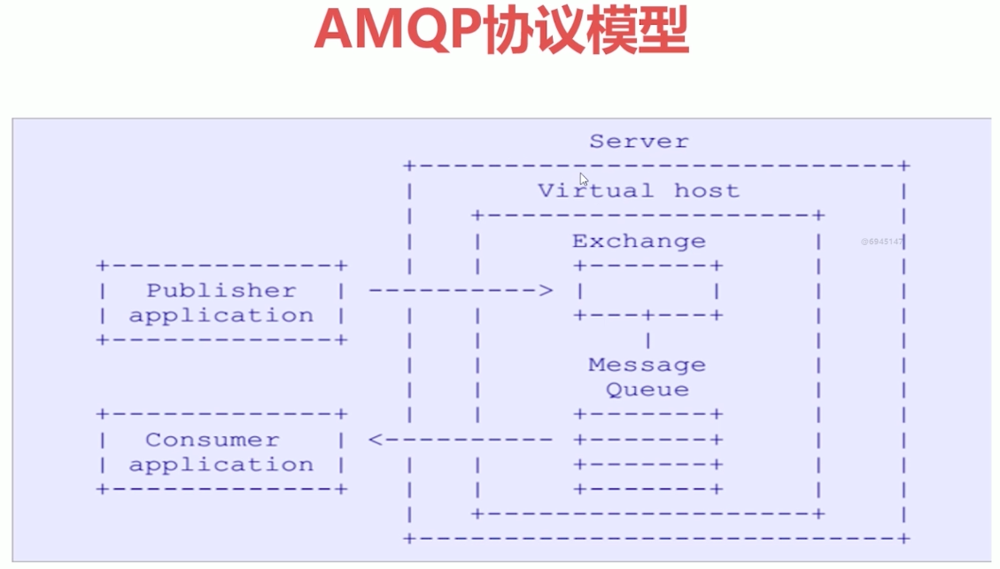

## 5.AMQP核心概念

+ Server:又称Broker，接受客户端连接，实现AMQP实体服务
+ Connection:连接，应用程序与Broker的网络连接
+ Channel:网络信道，几乎所有的操作都在Channel中进行，Channel是进行消息读写的通道，客户端可以建立多个Channel，每个Channel代表一个会话任务(一个Connection对应多个Channel)
+ Message:消息，服务器和应用程序之间传送的数据，由Properties和Body组成。Properties可以对消息进行修饰，比如消息的优先级、延迟等高级特性；Body则就是消息体内容
+ Virtual host:虚拟地址，用于进行逻辑隔离，最上层的消息路由。一个Virtual Host里面可以有若干个Exchange和Queue，同一个Virtual Host里面不能有相同名称的Exchange或Queue
+ Exchange:交换机，接收消息，根据路由键转发消息到绑定的队列.Durable
+ Binding:Exchange和Queue之间的虚拟连接，binding中可以包含routing key
+ Routing key:一个路由规则，虚拟机可用它来确定如何路由一个特定消息
+ Queue:也称为Message Queue，消息队列，保存消息并将他们转发给消费者

## 6.RabbitMQ的整体架构

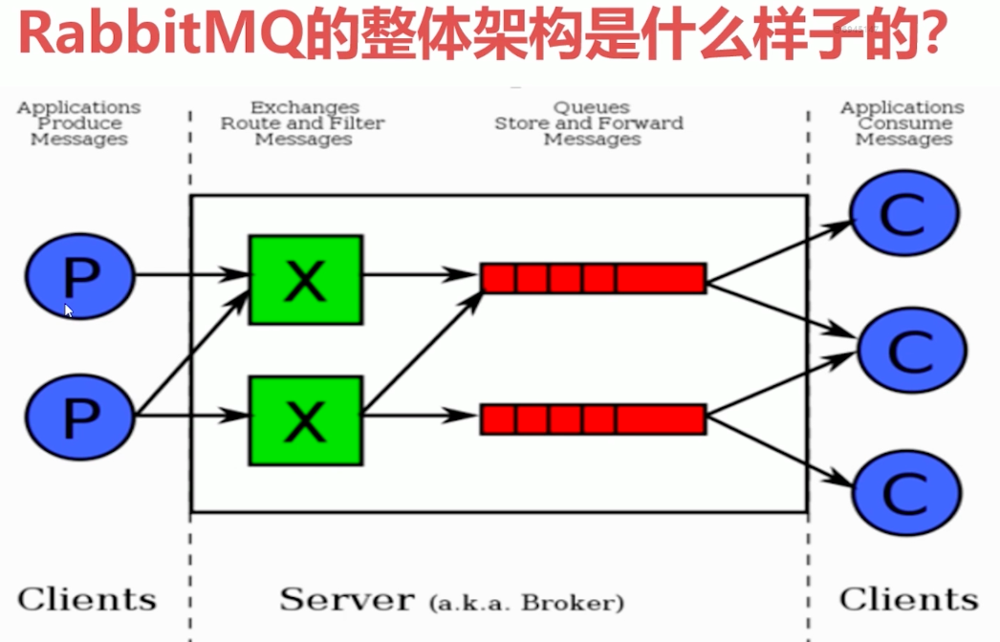

## 7.RabbitMQ的消息流转示意图

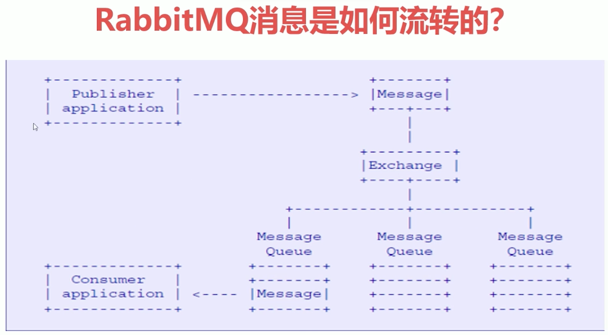

## 8.RabbitMQ的安装(使用Docker)

> docker run -d --hostname my-rabbit --name some-rabbit -p 15672:15672 -p 5672:5672 -p 25672:25672 -e RABBITMQ_DEFAULT_USER=root -e RABBITMQ_DEFAULT_PASS=aA111111 rabbitmq:3-management

+ `-e RABBITMQ_DEFAULT_USER=root`:指定用户名
+ `-e RABBITMQ_DEFAULT_PASS=aA111111`:指定密码

在rancher中的启动方式如下：

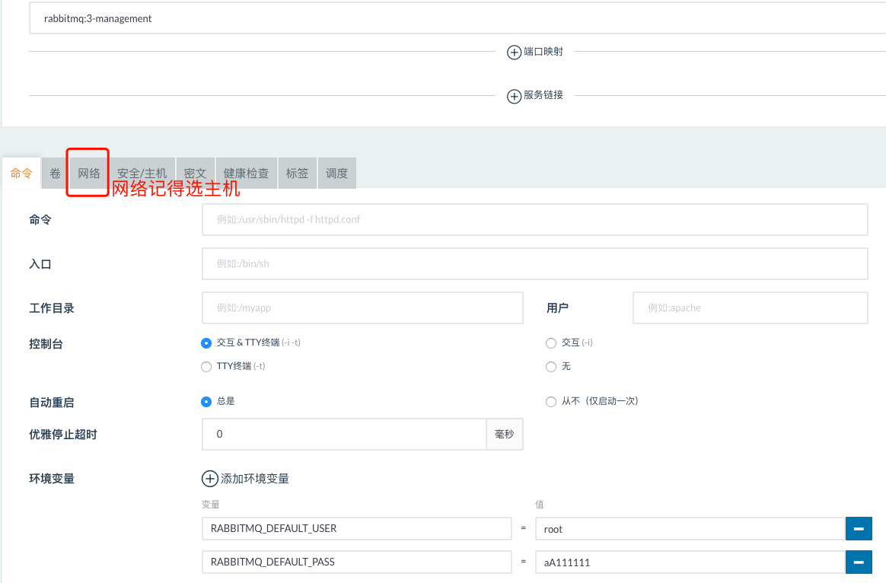

然后通过 http://ip:9527/#/ 即可访问RabbitMQ，用上面的**root-aA111111**即可访问RabbitMQ的Web界面.当不指定用户名和密码时，默认是**guest-guest**

web界面的功能介绍可见：[RabbitMQ管理界面](https://www.cnblogs.com/java-zhao/p/5670453.html)

## 9.RabbitMQ的命令行与管控台基础操作

> 可以直接在rancher中容器操作的'执行命令行'选项来执行下面的命令

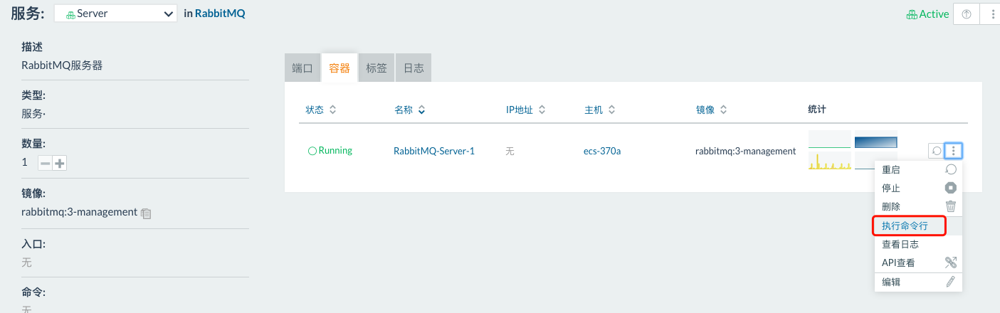

### 9.1 命令行

#### 基础操作

+ rabbitmqctl stop_app：关闭应用
+ rabbitmqctl start_app:启动应用
+ rabbitmqctl status:节点状态
+ rabbitmqctl add_user username password:添加用户
+ rabbitmqctl list_users:列出所有用户
+ rabbitmqctl delete_user username:删除用户
+ rabbitmqctl clear_permissions -p vhostpath username:清除用户权限
+ rabbitmqctl list_user_permissions username:列出用户权限
+ rabbitmqctl change_password username newpassword:修改密码
+ rabbitmqctl set_permissions -p vhostpath username ".*" ".*" ".*" :设置用户权限
+ rabbitmqctl add_vhost vhostpath: 创建虚拟主机
+ rabbitmqctl list_vhosts:列出所有虚拟主机
+ rabbitmqctl list_permissions -p vhostpath:列出虚拟主机上所有权限
+ rabbitmqctl delete_vhost vhostpath:删除虚拟主机
+ rabbitmqctl list_queues:删除所有队列消息
+ rabbitmqctl -p vhostpath purge_queue blue:清除队列里的消息

#### 高级操作

+ `rabbitmqctl reset`:移除所有数据，要在rabbitmqctl stop_app之后使用
+ `rabbitmqctl join_cluster <clusternode> [--ram]`:组成集群的命令
+ `rabbitmqctl cluster_status`:查看集群状态
+ `rabbitmqctl change_cluster_node_type disc | ram`:修改集群节点的存储形式
+ `rabbitmqctl forget_cluster_node [--offline]`:忘记节点(摘除节点)
+ `rabbitmqctl rename_cluster_node oldnode1 newnode1 [oldnode2] [newnode2]`:修改节点名称

### 9.2 管控台(网页版的DashBoard)

> 参考文章 [RabbitMq系列之三：web管理端](https://www.jianshu.com/p/7b6e575fd451)

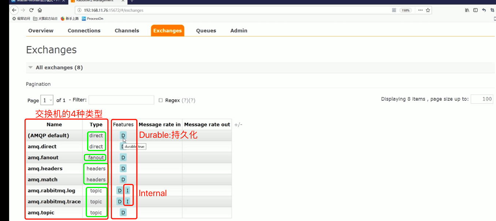

## 10.急速入门之消息生产与消费

+ 1.ConnectionFactory:获取连接工厂
+ 2.Connection:客户端创建一个连接
+ 3.Channel:连接后创建需要的数据通信信道，可发送和接收消息
+ 4.Queue:创建具体的消息存储队列
+ 5.Producer & Consumer:生产者和消费者

## 11.代码实战

> 代码见[quickstart](code/rabbitmqdemo/src/main/java/com/huawei/l00379880/rabbitmqdemo/quickstart)，注意事项：不指定Exchange,会默认走AMQP default的exchange，这时Producer端的routingKey和Consumer端的QueueName必须是相等的才能发消息`

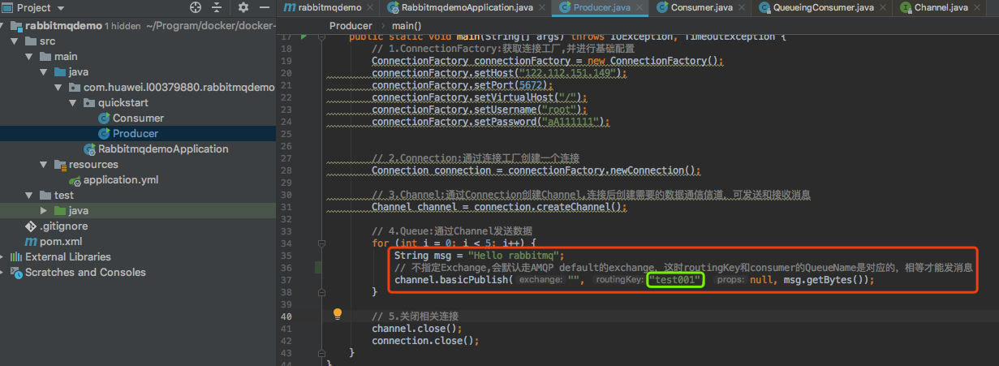
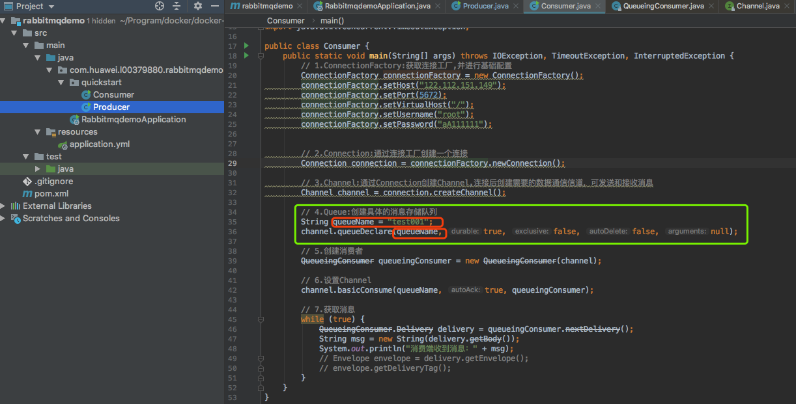
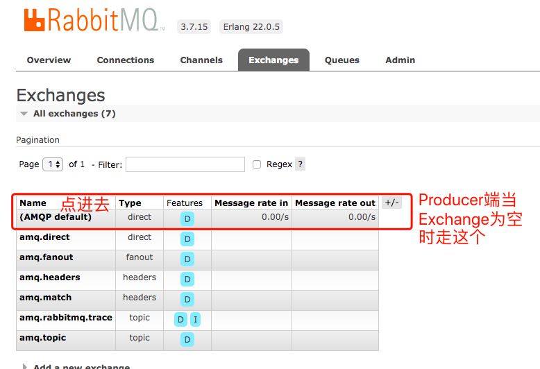
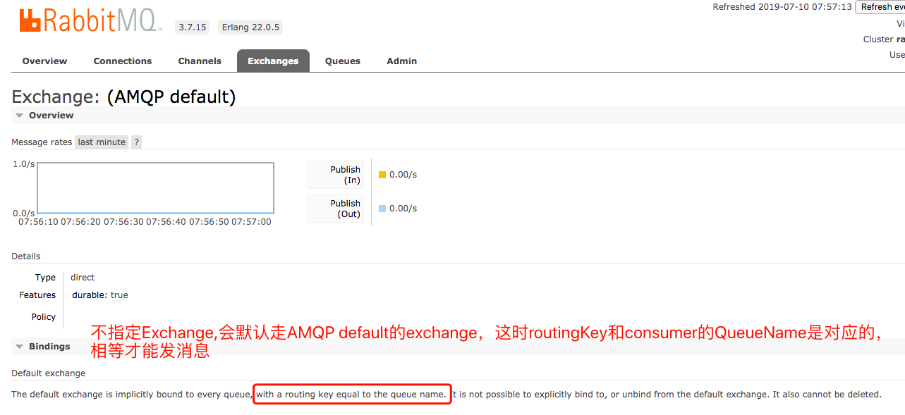

## 12.Exchange交换机

> Exchange:接收消息，并根据路由键转发消息所绑定的队列，图示如下

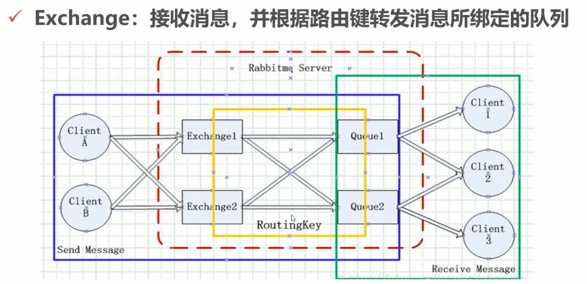

Exchange的常见属性解析：

+ `Name`:交换机名称
+ `Type`:交换机类型direct、topic、fanout、headers,**下面详解**
+ `Durability`:是否需要持久化,true为持久化
+ `Auto Delete`:当最后一个绑定到Exchange上的队列删除后，自动删除该Exchange
+ `Internal`:当前Exchange是否用于RabbitMQ内部使用，是地话为True,默认为false
+ `Arguments`:扩展参数，用于扩展AMQP协议自定制化使用

下面是常见的交换进Exchange的类型Type：

### 12.1 Direct Exchange

> 特点：所有发送到Direct Exchange的消息会被转发到RoutingKey中指定的Queue

注意：Direct模式可以使用RabitMQ自带的Exchange:`AMQP default`, 图示见[RabbitMQ当exchange为空时走AMQP_default策略2](images/RabbitMQ当exchange为空时走AMQP_default策略2.png),所以不需要将Exchange进行任何绑定(binding)操作，消息传递时，RoutingKey必须完全匹配才会被队列接收，否则会被抛弃

Direct Exchange的图示如下：

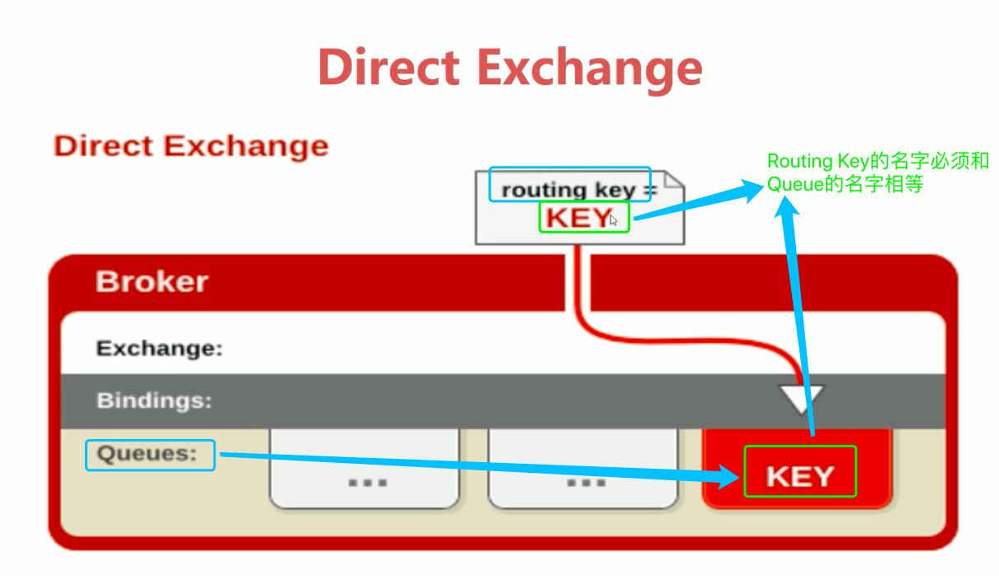

代码见 [exchange/direct](code/rabbitmqdemo/src/main/java/com/huawei/l00379880/rabbitmqdemo/exchange/direct)

Web管理界面如下：

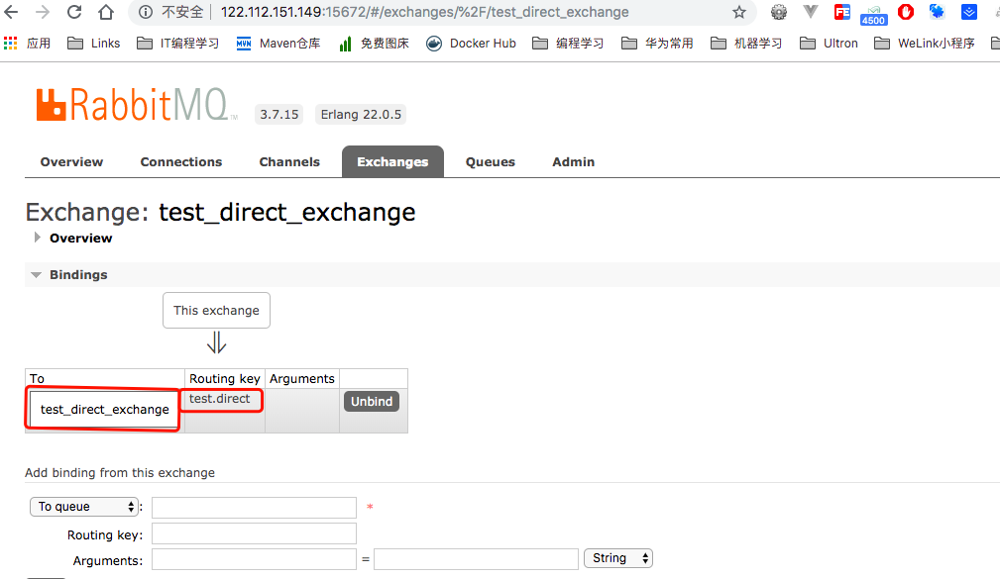

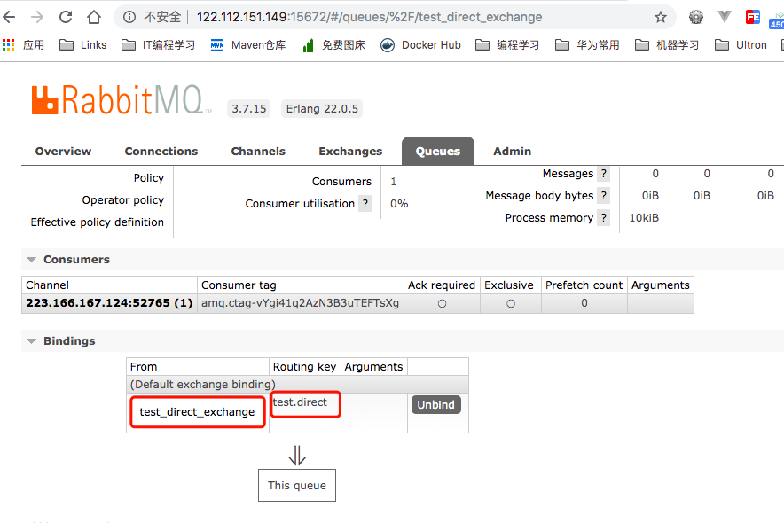

### 12.2 Topic Exchange

> 所有发送到Topic Exchange的消息都会被转发到所有关系RoutingKey中指定Topic的Queue上.最大的特点是支持模糊匹配

Exchange将RoutingKey和某Topic进行模糊匹配，此时队列需要绑定一个Topic

**注意**：可以使用通配符进行模糊匹配，比如：
+ 符号`#`匹配一个或多个词
  > 例如：`log.#`能够匹配到`log.info`和`log.info.1234567`
+ 符号`*`匹配不多不少一个词
  > 例如：`log.*`只能匹配到`log.info`，不能匹配到`log.info.1234567`
  
Topic Exchange的模糊匹配图示

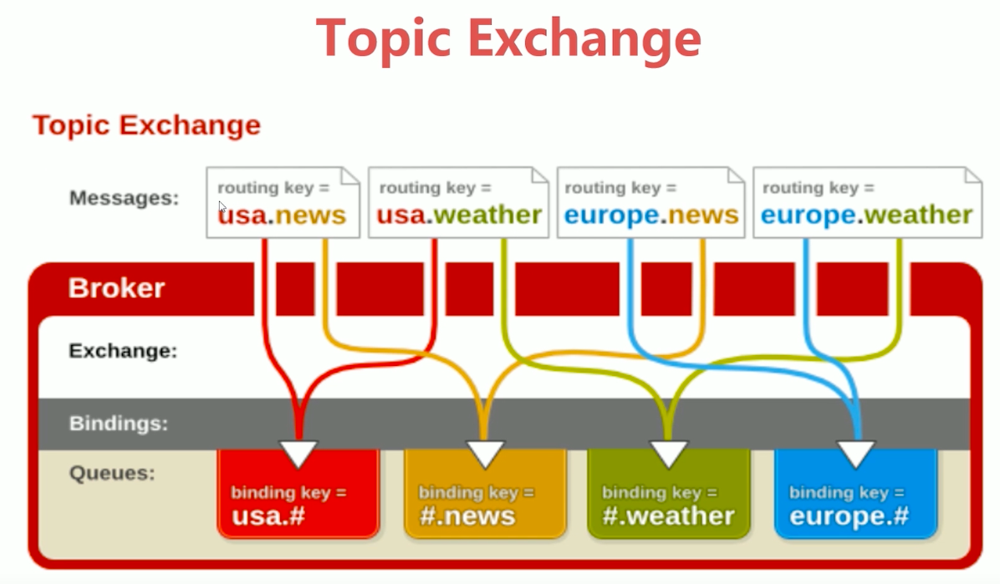

代码示例见[TopicExchange的代码实例](code/rabbitmqdemo/src/main/java/com/huawei/l00379880/rabbitmqdemo/exchange/topic)

代码的订阅关系如图：

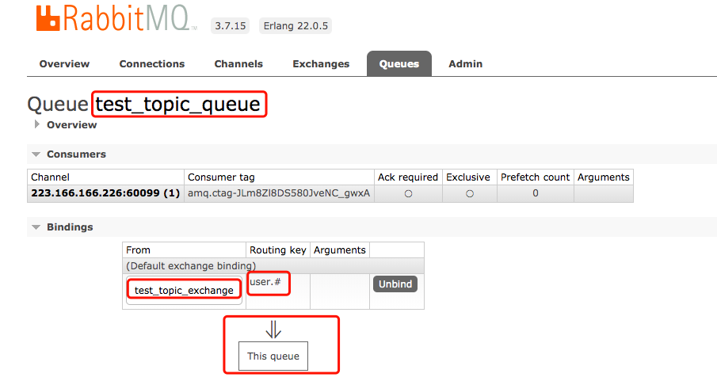
