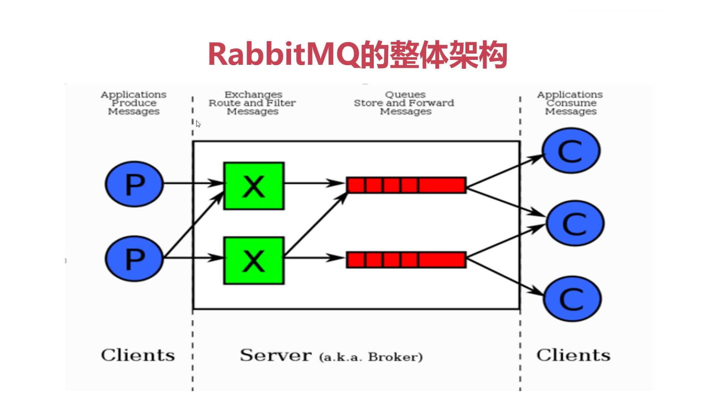

# 第1章 RabbitMQ起步

> RabbitMQ是一个开源的消息代理和队列服务器，用来通过普通协议在完全不同的应用之间共享数据，RabbitMQ是使用Erlang语言来编写地，并且RabbitMQ是基于AMQP协议的

## RabbitMQ特点

+ 底层采用Erlang语言编写，拥有和原生Socket相近的性能和低延迟
+ 开源、性能优秀，稳定性好
+ 与SpringAMQP完美整合，API丰富
+ 集群模式丰富，表达式配置，HA模式，镜像队列模型
+ 可以保证数据不丢失的前提下做到高可靠和高可用
+ 一般会加HAproxy做负载均衡，加Keepalived实现高可用
+ AMQP全称：Advanced Message Queuing Protocol,高级消息队列协议

## AMQP协议模型

> 详解见博客 [深入理解AMQP协议](https://blog.csdn.net/weixin_37641832/article/details/83270778)

## 安装RabbitMQ(使用Docker安装)

`docker run -d --hostname my-rabbit --name some-rabbit -p 8080:15672 -e RABBITMQ_DEFAULT_USER=root -e RABBITMQ_DEFAULT_PASS=aA111111 rabbitmq:3-management`

+ `-e RABBITMQ_DEFAULT_USER=root`:指定用户名
+ `-e RABBITMQ_DEFAULT_PASS=aA111111`:指定密码

然后通过 http://ip:9527/#/ 即可访问RabbitMQ，用上面的**root-aA111111**即可访问RabbitMQ的Web界面.当不指定用户名和密码时，默认是**guest-guest**

web界面的功能介绍可见：[RabbitMQ管理界面](https://www.cnblogs.com/java-zhao/p/5670453.html)

## RabbitMQ的整体架构

## RabbitMQ核心概念

+ **Server**:又称Broker，接受客户端的连接，实现AMQP实体服务
+ **Connection**:连接，应用程序与Broker的网络连接
+ **Channel**:网络信道，几乎所有的操作都在Channel中进行，Channel是进行消息读写的通道。客户端课件里多个Channel，每个Channel代表一个会话任务
+ **Messages**:消息，服务器与应用程序之间传输的数据，由Properties和Body组成。Properties可以对消息进行修饰，比如消息的优先级、延迟等高级特性；Bosy则就是消息体内容
+ **Virtual Host**:虚拟地址，用于进行逻辑隔离，最上层的消息路由。一个Virtual Host里面可以有若干个Exchange和Queue，同一个Virtual Host中不能有相同名称的Exchange或Queue
