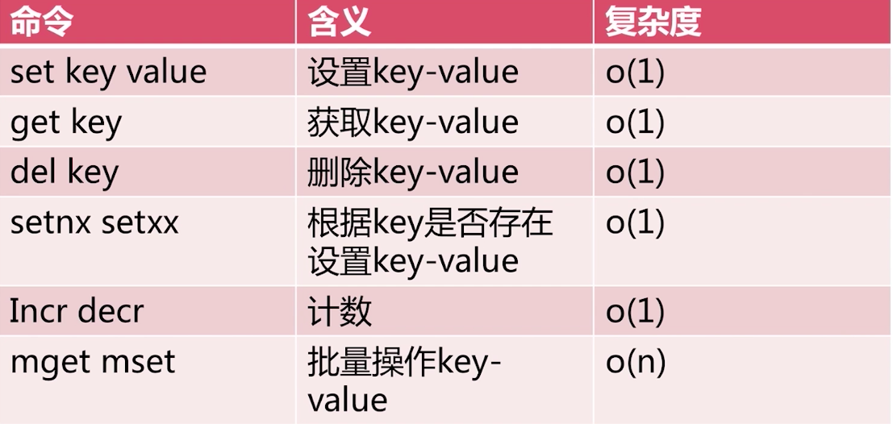

# 第2章 API的理解和使用

## 通用命令

+ keys:遍历所有的Key,还可以正则遍历。keys一般不在生产环境中使用
+ dbsize：计算key的总数
+ exists key：检查key是否存在，存在返回1，不存在返回0
+ del key [key ...]：删除指定的key-value
+ expire key seconds:设置key在seconds后过期
+ type key：key的类型(string、hash、list、set、zset、none)

## 数据结构

+ string
  + raw
  + int
  + embstr
+ hash
  + hashtable
  + ziplist
+ list
  + linkedlist
  + ziplist
+ set
  + hashtable
  + insert
+ zset
  + skiplist
  + ziplist

## 字符串类型

+ get
+ set
+ del
+ incr:自增1
+ decr:自减1
+ incrby：incrby key k, 键key自增k
+ decrby: decrby key k, 键key自减k
+ mget:批量获取，相比get能节省网络时间
+ mset:批量设置
+ getset:获取多个键的值
+ append:向键中追加内容
+ strlen:计算见的值的长度
+ incrbyfloat: incrbyfloat key 3.5,增加key对应的值3.5
+ getrange key start end:获取字符串指定下表所有的值
+ setrange key index value:设置指定下标所有对应的值

